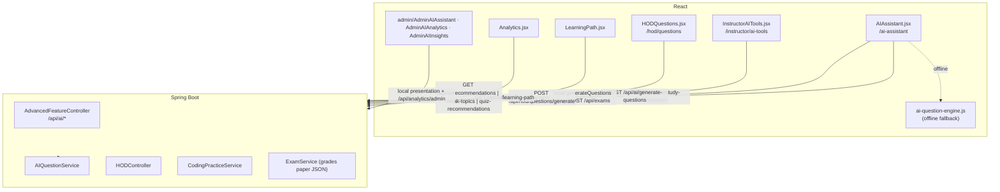
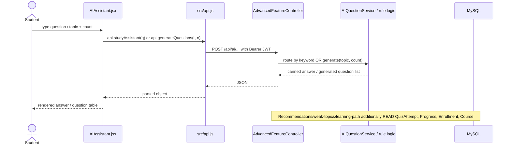
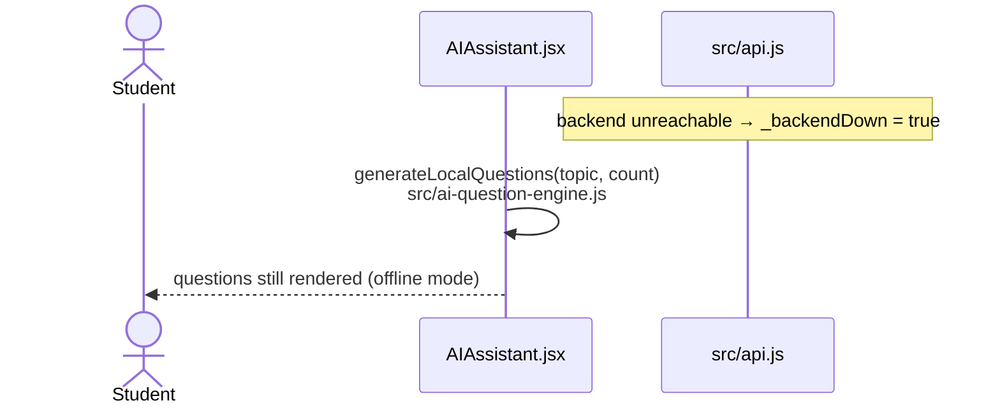

# AI-Smart-LMS — AI Architecture

> **Headline finding (verified across the whole repository):**
> **No machine-learning model, no Python service, no TensorFlow runtime and no external AI/LLM
> API is used anywhere in this project.** Every feature labelled "AI" today is **rule-based
> Java/JavaScript logic** — keyword matching, curated question banks, string templates and simple
> aggregates over the student's own data.
>
> Everything that does *not* exist yet is marked **PLANNED / NOT IMPLEMENTED**.

### Evidence used for this conclusion

- A repository-wide search for `gemini | openai | gpt | tensorflow | langchain | ollama |
  RestTemplate | WebClient | HttpURLConnection | api_key` returns **no HTTP client and no API key
  anywhere in `backend/src/main/java` or `src/`**. The only `TensorFlow` hits are *words inside
  answer text* and a UI footer string.
- `backend/pom.xml` contains no AI/ML/HTTP-client dependency (Web, Data JPA, Security,
  Validation, Actuator, DevTools, MySQL, Lombok, JJWT, tests only).
- `package.json` contains no AI SDK.
- There is **no `ai-service/`, no Python file, no `.env`** in the repository.

---

## 1. Inventory of AI features

| # | Feature | Status | Implementation type |
|---|---|---|---|
| 1 | AI Question Generator (server) | **IMPLEMENTED** | Curated banks + string templates |
| 2 | AI Question Generator (HOD, persists) | **IMPLEMENTED** | Same engine + `QuestionService` save |
| 3 | AI Question Generator (browser fallback) | **IMPLEMENTED** | `src/ai-question-engine.js` (same idea, local) |
| 4 | Instructor AI Tools (question paper builder) | **IMPLEMENTED** | Fully local generator inside `InstructorAITools.jsx` |
| 5 | AI Study Assistant | **IMPLEMENTED** | Keyword router → canned answers (`"mode":"simple-ai"`) |
| 6 | AI Course Recommendations | **IMPLEMENTED** | Keyword overlap ranking over DB data |
| 7 | AI Weak Topic Detection | **IMPLEMENTED** | `percentage < 60` filter over `QuizAttempt` |
| 8 | AI Learning Path | **IMPLEMENTED** | Completion check over `Progress` |
| 9 | AI Quiz Recommendations | **IMPLEMENTED** | Derived from #7 |
| 10 | Coding AI Assist (hint/explain/complexity/debug) | **IMPLEMENTED** | Templates + stored `hintsJson` |
| 11 | Admin AI Assistant / AI Analytics / AI Insights pages | **PARTIALLY IMPLEMENTED** | UI present; presentation-side logic over local/server data |
| 12 | Python (FastAPI) AI micro-service | **PLANNED / NOT IMPLEMENTED** | Claimed in a footer string only |
| 13 | TensorFlow / trained ML model | **PLANNED / NOT IMPLEMENTED** | Mentioned in text only |
| 14 | Gemini text integration | **PLANNED / NOT IMPLEMENTED** | §5 below |
| 15 | Gemini Live voice assistant | **PLANNED / NOT IMPLEMENTED** | §5 below |

---

## 2. Feature-by-feature breakdown

### 2.1 AI Question Generator — `AIQuestionService`

| Aspect | Detail |
|---|---|
| **Input** | `{ topic: string, count?: number (alias `limit`) }` |
| **Processing** | 1) normalize topic; 2) `getCuratedBankForTopic()` matches keywords (`oop/object/class/inherit/polymorph/encapsul`, `java` *(not javascript)*, `python`, `dbms/sql/database`, `data struct/dsa/algorithm/tree/graph`, `network/osi/tcp/ip`, `operating system/os/process/thread`, `web/html/css/react/javascript`) and pulls **hard-coded `QuestionItem` lists**; 3) de-duplicates by question text; 4) `generateAlgorithmicQuestions()` fills the remainder from **~10 sub-dimensions × string templates** with the topic substituted via `%s` |
| **Output** | `List<Map>`: `id, question, optionA..D, correctAnswer, explanation, difficulty, topic, marks, generatedBy:"AI-Smart-LMS-Engine"` |
| **Limits** | default count **100**, hard ceiling **200** |
| **Endpoint** | `POST /api/ai/generate-questions` (any authenticated user) · `POST /api/hod/questions/generate` (HOD, persists into a quiz when `quizId` supplied) |
| **Backend service** | `service/AIQuestionService.java` (683 lines) |
| **Frontend** | `src/pages/AIAssistant.jsx` (with `generateLocalQuestions` fallback), `src/pages/hod/HODQuestions.jsx` |
| **Type** | **rule-based template engine — not an ML model, not an LLM** |

> The HOD endpoint's `quizId` behaviour exists because "the Question Bank table actually showed
> nothing" when the list was returned unsaved — see the Javadoc on `HODController.generateQuestions`.

### 2.2 AI Study Assistant — `POST /api/ai/study-assistant`

| Aspect | Detail |
|---|---|
| **Input** | `{ question: string }` |
| **Processing** | `lowerQuestion.contains(...)` chain over **16 keyword groups**: `dependency injection` · `jwt`/`json web token` · `jpa`/`hibernate` · `oop`/`object oriented` · `sql`/`database`/`dbms` · `spring` · `react`/`javascript`/`frontend`/`web` · `algorithm`/`data structure`/`dsa` · `api`/`rest`/`endpoint` · `python` · `network`/`tcp`/`http`/`osi` · `operating system`/` os `/`thread`/`process` · `machine learning`/`ai `/`artificial intelligence`/`neural network`/`deep learning` · `git`/`version control` · `html`/`css` · `design pattern` → else a generic fallback |
| **Output** | `{ question, answer, mode: "simple-ai" }` — the `mode` field itself declares it is the simple rule-based mode |
| **Backend** | Inline in `AdvancedFeatureController.studyAssistant()` (lines ~2022–2276) |
| **Frontend** | `src/pages/AIAssistant.jsx` → `api.studyAssistant(question)` |
| **Type** | **keyword matching over canned text — no model, no LLM** |

### 2.3 AI Course Recommendations — `GET /api/ai/recommendations`

| Aspect | Detail |
|---|---|
| **Input** | current user (JWT) |
| **Processing** | builds a "signal" = the **title of the lowest-scoring quiz attempt**; takes all `APPROVED` courses **not** already enrolled; sorts by whether any word (length > 2) of that signal appears in `title + description + category`; returns top **5** |
| **Output** | `List<Course>` |
| **Type** | **rule-based keyword matching** |

### 2.4 AI Weak Topics — `GET /api/ai/weak-topics`

| Aspect | Detail |
|---|---|
| **Processing** | all of the user's `QuizAttempt` rows where `percentage < 60`; emits `{ topic: quizTitle, score, recommendation: "Review this topic and retry the quiz." }` |
| **Type** | **threshold rule over real data** |

### 2.5 AI Learning Path — `GET /api/ai/learning-path`

| Aspect | Detail |
|---|---|
| **Processing** | computes the set of enrolments where **every** lesson has a `Progress` row with `completed = true`; returns the first **8** `APPROVED` courses as `{courseId, title, status: COMPLETED \| RECOMMENDED}` |
| **Type** | **completion-status rule** |

### 2.6 AI Quiz Recommendations — `GET /api/ai/quiz-recommendations`

Re-shapes weak topics into `{ topic, reason: "Low quiz score", action: "Practice this quiz again" }`.

### 2.7 Coding AI Assist — `POST /api/coding/ai-assist`

| Aspect | Detail |
|---|---|
| **Input** | `{ problemId, language, code, action, userPrompt }` |
| **Processing** | `switch (action)` → `explain` (builds markdown from the problem's own fields), `hint` (random entry from the stored `hintsJson`, else a generic hint), `complexity` (fixed complexity text), `debug` (fixed diagnostic template), plus more |
| **Backend** | `CodingPracticeService.getAiAssist(...)` |
| **Frontend** | `src/pages/CodingPlayground.jsx` |
| **Type** | **templates over stored problem metadata — the code is never analysed by a model** |

### 2.8 Instructor AI Tools — `src/pages/instructor/InstructorAITools.jsx`

A browser-side question **paper** builder: it has its own `generateQuestions(topic, type, count)`
over local pools (1-liner / 2-marker / 3-marker / 5-marker / MCQ), parses the generated lines,
assembles `{ title, subject, sections, totalQuestions, totalMarks, duration, difficulty }`, and then
**uploads it as an exam**:

```js
await api.instructorCreateExam({ ..., questionPaper: JSON.stringify(paperData), course: { id } })
```

That JSON is what `ExamService.gradeSubmission()` later grades against.
**100 % client-side generation, 0 % external AI.**

### 2.9 Analytics (often presented as "AI analytics")

`GET /api/analytics/student`, `/api/analytics/course/{id}`, `/api/analytics/admin` — plain
aggregations over `QuizAttempt`, `Progress`, `Enrollment`, `Course`, `User`. No model.

---

## 3. Where each AI feature lives



---

## 4. AI request flow (text) — as actually implemented





**Voice flow:** there is **no microphone capture, no speech recognition and no streaming audio
anywhere in the source** → **PLANNED / NOT IMPLEMENTED** (see §5.2).

---

## 5. PLANNED Gemini Architecture — *not implemented*

> **Nothing in this section exists today.** It is the recommended integration path that can be
> added **without changing any existing endpoint, database table, role rule or page** — because
> every current AI feature already sits behind a single controller/service seam.

### 5.1 Text assistant (drop-in replacement behind the existing endpoint)

```
React (AIAssistant.jsx)
        │  POST /api/ai/study-assistant   { question }
        ▼
Spring Boot (AdvancedFeatureController.studyAssistant)
        │  new StudyAssistantEngine.answer(question, context)
        ▼
   ┌─────────────────────────────┬──────────────────────────────┐
   │  existing rule-based path   │  NEW: GeminiClient (optional) │
   │  (keep as fallback,        │  - reads GEMINI_API_KEY from  │
   │   used when key missing     │  - server-side only           │
   │   or API fails)             │  - short timeout + fallback   │
   └─────────────────────────────┴──────────────────────────────┘
        ▼
   answer JSON { question, answer, mode: "gemini" | "simple-ai" }
        ▼
React renders the answer
```

**Why this is safe to add**
- The response shape `{ question, answer, mode }` already exists — only the `mode` value changes.
- `AIQuestionService` can be swapped the same way: keep the curated bank as a fallback, return
  `generatedBy: "gemini"` instead of `"AI-Smart-LMS-Engine"` when the model answers.
- No database change is required (the generated questions are either returned as JSON or saved
  through the existing `QuestionService.createQuestion(quizId, q)` path).
- All role rules (`requireHOD`, `requireCourseManage`) stay exactly where they are.

### 5.2 Voice assistant — Gemini Live (PLANNED)

```
React: getUserMedia() microphone + WebAudio
        │  (browser captures audio, does NOT hold any key)
        ▼
Spring Boot: POST /api/ai/live-token   ← protected by the normal JWT
        │  verifies the user's JWT + role
        │  mints a SHORT-LIVED access token / session handle
        ▼
Gemini Live API (WebSocket)  ◄── server-brokered or short-lived token handed to the client
        │  audio in → audio out
        ▼
React plays the audio response
```

**Two acceptable variants**
1. **Server-brokered (recommended):** Spring Boot keeps the long-lived key, opens the WebSocket to
   Gemini Live, and relays audio frames to the browser. The browser never sees any secret.
2. **Short-lived token:** Spring Boot exchanges the long-lived `GEMINI_API_KEY` for a
   time-limited OAuth/access token, hands *that* to the browser for a direct Gemini Live socket.
   The long-lived key still never leaves the server.

### 5.3 Where to add it (files, no existing behaviour touched)

| Concern | File to extend | Change |
|---|---|---|
| HTTP client to Gemini | **new** `backend/.../service/GeminiClient.java` | only new class |
| Text answers | `AdvancedFeatureController.studyAssistant(...)` | delegate, keep rule path as fallback |
| Question generation | `AIQuestionService.generateQuestions(...)` | delegate, keep curated bank as fallback |
| Coding assist | `CodingPracticeService.getAiAssist(...)` | delegate for `explain`/`debug` |
| Voice token endpoint | **new** handler (or a new small controller) | new endpoint only |
| Config | `application.properties` | `gemini.api.key=${GEMINI_API_KEY:}` (empty default ⇒ rule-based mode) |
| Frontend voice UI | `src/pages/AIAssistant.jsx` | new panel; existing text panel unchanged |

### 5.4 `GEMINI_API_KEY` storage rules

| Do | Don't |
|---|---|
| Store it in the **server** environment / `application.properties` referenced as `${GEMINI_API_KEY}` | ❌ Never put it in `src/`, `import.meta.env` or any Vite `VITE_*` variable — everything in the React bundle is readable in the browser |
| Keep it out of git (`.env` is git-ignored; `application.properties` is currently committed — move the key to an env var) | ❌ Never commit the literal key |
| Send it only in outbound server→Google requests | ❌ Never return it in any API response |
| Add per-user rate limiting on `/api/ai/*` before enabling a paid model | ❌ Don't let an authenticated student trigger unbounded spend |

> Note: the **current** project already hard-codes two secrets in committed files
> (`application.properties` DB password, `JwtService.SECRET_KEY`). Gemini must not repeat that
> pattern — see SECURITY.md → *Security Observations*.

---

## 6. Honest positioning for a report / viva

**Say this:**
> "Our AI layer is a **rule-based expert system**: a curated plus template-based question
> generator, a keyword-routed study assistant, and analytics-driven recommendations computed from
> real student data. It is deliberately isolated in `AIQuestionService` and the `/api/ai/*`
> endpoints so that a large language model such as Gemini can be plugged in later without
> touching authentication, roles, the database or any other feature. The Gemini integration is
> **planned, not yet implemented**."

**Do not say:** "we use TensorFlow", "we call the Gemini API", "we have a Python micro-service",
"we have a voice assistant" — none of these exist in the source code.
