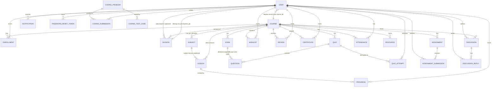

# AI-Smart-LMS — Database Design

Derived **only** from the JPA entities in
`backend/src/main/java/com/aismartlms/backend/entity/` and the repositories in
`backend/src/main/java/com/aismartlms/backend/repository/`.

- **Engine:** MySQL, database **`ai_smart_lms`**
- **Schema strategy:** `spring.jpa.hibernate.ddl-auto=update` — Hibernate creates/alters tables
  from the entities at startup. **No Flyway/Liquibase migrations exist.**
- **`backend/database/setup.sql`** only runs `CREATE DATABASE IF NOT EXISTS ai_smart_lms;`
  and documents the seeder.
- **Seeding:** `config/DataSeeder.java` (idempotent `CommandLineRunner`) inserts 10 degree
  programs + subjects + starter lessons, the default accounts, divisions and default
  instructor assignments.

**Entity count: 27 `@Entity` classes + 1 enum (`Role`).**

---

## 1. ER diagram (actual relationships)

### Relationship summary

| Type | Relationships |
|---|---|
| **One-to-Many** | `Course→Subject`, `Course→Lesson`, `Subject→Lesson`, `Course→Quiz`, `Quiz→Question`, `Course→Exam`, `Course→Enrollment`, `User→Enrollment`, `User→Progress`, `Lesson→Progress`, `User→QuizAttempt`, `Quiz→QuizAttempt`, `User→Wishlist`, `Course→Wishlist`, `User→Review`, `Course→Review`, `User→Certificate`, `Course→Certificate`, `Course→Assignment`, `Assignment→AssignmentSubmission`, `User→AssignmentSubmission`, `User→Attendance`, `Course→Attendance`, `Course→Resource`, `Course→Discussion`, `User→Discussion`, `Discussion→DiscussionReply`, `User→DiscussionReply`, `User→Notification`, `User→PasswordResetToken`, `User→CodingSubmission`, `CodingProblem→CodingSubmission`, `CodingProblem→CodingTestCase`, `Course→Division` |
| **Many-to-One** | the inverse of every row above (e.g. `Enrollment.user`, `Lesson.course`, `Exam.course`) |
| **Many-to-Many** | **none** — there is no `@ManyToMany` anywhere. "User ↔ Course" is modelled as the `enrollments` join entity, and `User.course` is a plain degree-program FK |
| **Shared-PK / One-to-One** | **none** |

### Relationships with **no JPA association** (plain `Long` columns)

| Entity | Loose FK columns | Consequence |
|---|---|---|
| `InstructorCourseAssignment` | `instructorId`, `courseId`, `subjectId`, `assignedBy` | Joining is done manually in `HODService` / `InstructorAccessService` |
| `Announcement` | `postedBy` (Long), `courseCode` (String) | No link to `users`/`courses` tables |
| `Exam` | `subjectId`, `createdBy`, `approvedBy` (Long) + denormalised `subjectName`, `createdByName`, `approvedByName` | Deliberate: "list views never join the users table" |

---

## 2. Entity catalogue

### 2.1 Identity & access

#### `User` → table `users`
| Field | Type | Notes |
|---|---|---|
| `id` | Long **PK** | identity |
| `name` | String, not null | |
| `email` | String, **unique**, not null | also the JWT subject |
| `password` | String, not null | BCrypt hash; `@JsonProperty(WRITE_ONLY)` |
| `role` | enum `Role` (STRING), not null | `STUDENT` / `INSTRUCTOR` / `HOD` / `ADMIN` |
| `active` | Boolean (default `true`) | instructors sign up `false` |
| `phone`, `dateOfBirth`, `gender`, `bio` | profile | |
| `course` | ManyToOne → `Course` (nullable) | the student's degree program |
| `division` | ManyToOne → `Division` (nullable) | section (e.g. "BCA Div A") |

#### `Role` (enum) — `STUDENT`, `INSTRUCTOR`, `HOD`, `ADMIN`

#### `PasswordResetToken` → `password_reset_tokens`
`id` PK · `token` (unique, not null) · `user` ManyToOne not null · `expiresAt` (30 min).

---

### 2.2 Curriculum

#### `Course` → `courses` — *the central table*
`id` PK · `title` (not null) · `courseCode` (BCA, MBA…) · `courseName` · `duration` ·
`totalSemesters` · `description` (TEXT, not null) · `instructor` (denormalised **String**) ·
`category` · `difficulty` (default `BEGINNER`) · `status` (default `APPROVED`) · `price` (default 0) ·
`createdAt` · **`lessons` 1—\*** · **`subjects` 1—\***

#### `Subject` → `subjects`
`id` PK · `subjectCode` · `subjectName` (not null) · `description` TEXT · `semester` (not null) ·
`course` ManyToOne not null · **`lessons` 1—\***

#### `Lesson` → `lessons`
`id` PK · `title` not null · `description` TEXT not null · `content` TEXT not null · `videoUrl` ·
`lessonOrder` not null · `durationMinutes` not null ·
`course` ManyToOne **not null** · `subject` ManyToOne **nullable** ·
`currentSubjectId()` exposed as JSON `subjectId` (deliberately not a JavaBean getter — see code comment).

#### `Division` → `divisions`
`id` PK · `name` not null · `code` (≤ 8) not null · `academicYear` · `semester` ·
`maxCapacity` (default 60) · `course` ManyToOne not null · `classTeacher` ManyToOne nullable ·
`createdAt`, `updatedAt` (+ `@PreUpdate`).

---

### 2.3 Learning & enrolment

#### `Enrollment` → `enrollments`
`id` PK · `user` ManyToOne not null · `course` ManyToOne not null.
*Effectively a user×course join row; unique-constraint enforcement is done in code
(`existsByUserAndCourse`).*

#### `Progress` → `progress`
`id` PK · `user` ManyToOne not null · `lesson` ManyToOne not null ·
`progressPercentage` int default 0 · `completed` Boolean default false ·
`startedAt`, `completedAt`.

#### `Announcement` → `announcements`
`id` PK · `title` not null · `content` TEXT · `postedBy` (Long) · `postedByRole` (String) ·
`courseCode` (String) · `createdAt`.

---

### 2.4 Assessment — quizzes

#### `Quiz` → `quizzes`
`id` PK · `title` not null · `description` TEXT · `course` ManyToOne not null · **`questions` 1—\***

#### `Question` → `questions`
`id` PK · `questionText` TEXT not null · `optionA..optionD` (all **not null**) ·
`correctAnswer` not null · `marks` (default 1) · `questionOrder` not null ·
`quiz` ManyToOne **not null** (`quiz_id`).

> Only MCQ is representable here. Descriptive / 1-liner / 2-3-5 marker questions exist **only
> inside `Exam.questionPaper` JSON**.

#### `QuizAttempt` → `quiz_attempts`
`id` PK · `quiz` ManyToOne not null · `user` ManyToOne (nullable) · `score` · `totalMarks` ·
`percentage` · `passed` · `attemptedAt` (not null).

---

### 2.5 Assessment — exams (approval workflow columns)

#### `Exam` → `exams`
| Group | Fields |
|---|---|
| Core | `id` PK · `title` not null · `description` TEXT · `course` ManyToOne not null (write-only in JSON) · `durationMinutes` (60) · `totalMarks` (100) · `passingMarks` (40) · `negativeMarking` (false) · `negativeMarkValue` (0.0) · `startTime`, `endTime` · `status` (default `SCHEDULED`) · `createdAt` |
| Structure | `subjectId` (Long, plain) · `subjectName` (denormalised) |
| Approval workflow | `createdBy`, `createdByName`, `submittedAt`, `approvedBy`, `approvedByName`, `approvedAt`, `rejectionReason` (TEXT), `publishedAt` |
| Paper | `questionPaper` (**TEXT = JSON-serialized paper**, sections/questions/answer key) |
| Collection | `questions` `@OneToMany(mappedBy = "quiz")` |

Status values used by the code: `DRAFT`, `PENDING_HOD_APPROVAL`, `REJECTED`, `APPROVED`,
`PUBLISHED`, `COMPLETED` (+ legacy `SCHEDULED`/`LIVE`).

**JSON projection:** `@JsonProperty("courseId") getCourseRefId()` and
`@JsonProperty("courseName") getCourseRefName()` — named deliberately so Spring Data does not
mis-read them as entity attributes.

---

### 2.6 Teaching operations

#### `Assignment` → `assignments`
`id` PK · `title` not null · `description` TEXT · `course` ManyToOne not null · `subject` (String) ·
`dueDate` · `maximumMarks` (100) · `attachmentUrl` · `status` (`ACTIVE`) · `createdAt` ·
**`submissions` 1—\***

#### `AssignmentSubmission` → assignment submissions
`id` PK · `assignment` ManyToOne · `user` ManyToOne · `answerText` · `fileUrl` · `marks` ·
`feedback` · `gradedAt` (+ `status` set to `GRADED` by `AssignmentService.gradeSubmission`).

#### `Attendance` → `attendance`
`id` PK · `user` ManyToOne not null · `course` ManyToOne not null · `subject` (String) ·
`date` (LocalDate, not null) · `status` (default `PRESENT`) · `remarks` · `createdAt`.

#### `Resource` → `resources`
`id` PK · `title` not null · `description` TEXT · `type` (`DOCUMENT|VIDEO|LINK|IMAGE|OTHER`) ·
`url`, `fileName`, `filePath`, `fileSize` · `category` · `visibility` (`COURSE|PUBLIC|PRIVATE`) ·
`course` ManyToOne not null · `uploadedBy` (String) · `downloadCount` · `createdAt`, `updatedAt`.
Files land in `app.upload.dir = uploads/resources` (max 50 MB).

#### `Discussion` / `DiscussionReply`
`Discussion`: `id` PK · `title` not null · `content` TEXT not null · `author` ManyToOne not null ·
`course` ManyToOne **nullable** · `tag` · `solved` (false) · `likes` (0) · `createdAt` ·
**`replies` 1—\***
`DiscussionReply`: `id` PK · `content` TEXT not null · `author` ManyToOne not null ·
`discussion` ManyToOne not null · `likes` (0) · `isTeacherResponse` (false) · `createdAt`.

---

### 2.7 Recognition & communication

#### `Certificate` → `certificates`
`id` PK · `certificateId` (**unique**, `CERT-XXXXXXXX`) · `user` ManyToOne not null ·
`course` ManyToOne not null · `score` (Double) · `status` (`VALID|REVOKED|EXPIRED`) ·
`revocationReason` TEXT · `instructorName` · `issuedAt`, `revokedAt`.

#### `Notification` → `notifications`
`id` PK · `user` ManyToOne not null · `title` not null · `message` TEXT ·
`readFlag` (false) · `createdAt`.

#### `Wishlist` → `wishlists` — `id` PK · `user` · `course` · **`@UniqueConstraint(user_id, course_id)`**

#### `Review` → `reviews` — `id` PK · `user` · `course` · `rating` (Integer, not null) ·
`comment` TEXT · `createdAt` · **`@UniqueConstraint(user_id, course_id)`**

---

### 2.8 HOD organisation

#### `InstructorCourseAssignment` → instructor assignments
`id` PK · `instructorId` (Long) · `courseId` (Long) · `subjectId` (Long, 0/null = course-wide) ·
`assignedBy` (Long) · `status` (default `ACTIVE`).
No JPA associations — looked up through `InstructorCourseAssignmentRepository`
(`findByInstructorIdAndStatus`).

---

### 2.9 Coding arena

#### `CodingProblem` → `coding_problems`
`id` PK · `title` · `slug` **unique** · `difficulty` (`EASY|MEDIUM|HARD`) · `category` ·
`description` **LONGTEXT** · `inputFormat`, `outputFormat`, `constraints` (TEXT) ·
`timeLimitMs` (2000) · `memoryLimitMb` (256) · `points` (100) · `xpReward` (50) ·
`totalSubmissions`, `totalAccepted` · `starterCodeJson`, `hintsJson` (LONGTEXT) ·
`solutionExplanation` (LONGTEXT) · `tags` · `isDailyChallenge` (false) · `orderIndex` · `createdAt`.

#### `CodingTestCase` → coding test cases — `id` PK · `problem` ManyToOne · `input` ·
`expectedOutput` · `explanation` · `orderIndex` · `isSample`.

#### `CodingSubmission` → `coding_submissions` — `id` PK · `user` ManyToOne not null ·
`problem` ManyToOne not null · `language` · `code` LONGTEXT ·
`status` (`ACCEPTED|WRONG_ANSWER|TIME_LIMIT_EXCEEDED|RUNTIME_ERROR|COMPILATION_ERROR`) ·
`passedTestCases`, `totalTestCases` · `executionTimeMs`, `memoryKb` · `errorMessage` (TEXT) ·
`outputLog` (LONGTEXT) · `score`, `xpEarned` · `submittedAt`.

---

## 3. Repositories (27 `JpaRepository` interfaces)

`Announcement` · `Assignment` · `AssignmentSubmission` · `Attendance` · `Certificate` ·
`CodingProblem` · `CodingSubmission` · `CodingTestCase` · `Course` · `Discussion` ·
`DiscussionReply` · `Division` · `Enrollment` · `Exam` · `InstructorCourseAssignment` ·
`Lesson` · `Notification` · `PasswordResetToken` · `Progress` · `Question` · `Quiz` ·
`QuizAttempt` · `Resource` · `Review` · `Subject` · `User` · `Wishlist`

Query styles used:
- **Derived queries** — `findByUserAndCourse`, `findByStatusOrderByCreatedAtDesc`,
  `findByInstructorIdAndStatus`, `existsByCourseIdAndCodeAndAcademicYear`, …
- **`@Query` JPQL** — e.g. `CourseRepository` counts of instructors/students by role,
  `CodingSubmissionRepository` solved/attempted problem ids and XP sums.
- No native SQL migrations; `DataSeeder` does one **JDBC** check to widen a legacy
  `users.role` ENUM column to VARCHAR.

---

## 4. Data observations (documented, not changed)

1. **Exam results are not stored.** `ExamService.gradeSubmission()` returns a `Map`; there is no
   `ExamAttempt` entity/table, so a student's exam score history does not exist in the DB.
   **PARTIALLY IMPLEMENTED.**
2. **`Exam.questions` is mapped by `"quiz"`.** `Exam` declares
   `@OneToMany(mappedBy = "quiz") List<Question> questions`, i.e. it reuses the `questions.quiz_id`
   column that actually points at `quizzes`. Exam grading does **not** use this collection — it
   reads `Exam.questionPaper` JSON instead. Treat `exam.questions` as unreliable.
3. **Two sources of truth for "questions".** Quiz questions live in `questions`; the exam paper
   lives in `exams.question_paper` (JSON). They are not linked by foreign key.
4. **Denormalisation by design:** `Course.instructor`, `Announcement.postedBy/courseCode`,
   `Exam.subjectName/createdByName/approvedByName`, `Certificate.instructorName`,
   `Resource.uploadedBy` are plain strings — updates to the `users` row do not cascade.
5. **No `@ManyToMany`.** Enrolments are an explicit join entity; degree membership is a single FK.
6. **`ddl-auto=update`** never changes an existing column type — the `DataSeeder` works around
   this for the legacy `users.role` ENUM.
7. **`Division` uniqueness** (course + code + academic year) is enforced in
   `HODService.existsByCourseIdAndCodeAndAcademicYear(...)` rather than a table constraint
   (comment in the entity explains a Hibernate 5.6 schema-update bug).
