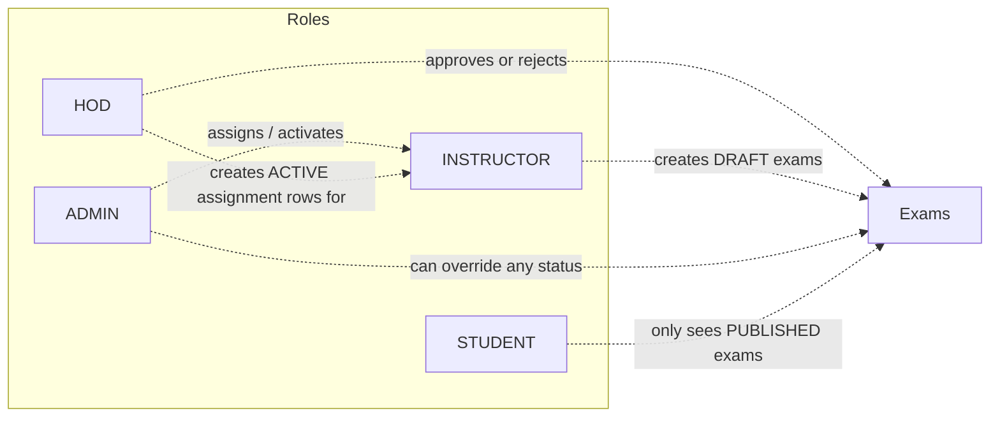

# AI-Smart-LMS — Security Architecture

> This document describes **what the code actually does today**.
> Problems found during inspection are listed under **§7 Security Observations** —
> **documented only, deliberately not fixed**, per the request.

---

## 1. Authentication technology

| Aspect | Actual implementation | Source file |
|---|---|---|
| Style | **Stateless JWT** (`SessionCreationPolicy.STATELESS`) — no HTTP sessions, no cookies | `security/SecurityConfig.java` |
| Library | **JJWT 0.11.5** (`jjwt-api`, `jjwt-impl`, `jjwt-jackson`) | `backend/pom.xml` |
| Algorithm | HMAC-SHA (`Keys.hmacShaKeyFor(...)`) over a literal secret | `security/JwtService.java` |
| Secret | `"AI-Smart-LMS-Super-Secret-Key-2026-Change-This"` — **hard-coded constant** | `JwtService.SECRET_KEY` |
| Token subject | the user's **e-mail** | `generateToken(email)` |
| Claims issued | `sub`, `iat`, `exp` — **no `jti`, no roles, no refresh-token record** | `JwtService.generateToken` |
| Lifetime | **24 hours** (`1000L * 60 * 60 * 24`) | `JwtService.generateToken` |
| Transport | `Authorization: Bearer <token>` header | `src/api.js` → `apiRequest()` |
| Storage (browser) | `localStorage.token` + `localStorage.user` | `src/pages/Login.jsx`, `src/api.js` |
| Revocation | **none** — logout is client-side (`localStorage.removeItem`) | `src/App.jsx` / layouts |

---

## 2. Password handling

- **Hashing:** `BCryptPasswordEncoder` bean in `SecurityConfig`.
- **Verification:** `AuthService.login()` → `passwordEncoder.matches(raw, user.getPassword())`.
- **Storage safety:** `User.password` is annotated `@JsonProperty(access = WRITE_ONLY)` so it is
  never serialised in a response; `AuthService.userInfo()` also builds the payload manually.
- **Password policy (actual):**
  - Instructor self-signup: **minimum 6 characters**, plus `confirmPassword` match.
  - Student self-registration: **no length rule** — only "confirm == password".
  - Admin force-reset: no policy.
- **Reset flow:** `POST /api/auth/forgot-password` creates a `PasswordResetToken`
  (UUID, 30-minute `expiresAt`); `POST /api/auth/reset-password` validates, BCrypt-saves the new
  password and deletes the token. **No email is sent** — the token is returned in the HTTP response
  ("Demo mode").

---

## 3. Spring Security configuration (`SecurityConfig`)

```mermaid
flowchart TD
    R[Incoming request] --> C[CORS check<br/>allowedOriginPatterns localhost/*, 127.0.0.1/*, *<br/>all methods, Authorization/Content-Type/Accept<br/>allowCredentials = true]
    C --> CS[CSRF disabled]
    CS --> SM[Session: STATELESS]
    SM --> Q{Path}
    Q -->|"/api/auth/register", "/api/auth/register/instructor", "/api/auth/login"| P1[permitAll]
    Q -->|"/api/courses" and its semester/subject sub-paths| P1
    Q -->|/actuator/**| P1
    Q -->|everything else| A[authenticated]
    A --> F[JwtAuthenticationFilter<br/>runs before UsernamePasswordAuthenticationFilter]
    F -->|no/invalid token| E1[AuthenticationEntryPoint → 401 JSON body]
    F -->|token OK| U[Load user by email → ROLE_ + Role]
    U --> H{Handler-level checks}
    H -->|denied| E2[AccessDeniedHandler → 403 JSON body]
    H -->|allowed| CT[Controller → Service → Repository]
```

### Components

| Component | What it does |
|---|---|
| `JwtAuthenticationFilter` (`OncePerRequestFilter`) | Reads `Authorization: Bearer …`, extracts e-mail, loads `User`, builds authority `ROLE_<Role>`, sets `SecurityContextHolder`. Any exception → context cleared, request continues unauthenticated. |
| `JwtService` | `generateToken`, `extractEmail`, `isTokenValid`, `isTokenExpired`. |
| `UserDetailsService` bean | Looks up by e-mail, throws `UsernameNotFoundException` otherwise; authorities come from `user.getRole()`. |
| `AuthenticationProvider` | `DaoAuthenticationProvider` + BCrypt. |
| `AuthenticationEntryPoint` | Unauthenticated → **401** `{"error":"Unauthorized. Please login again."}` (JSON, not an empty 403). |
| `AccessDeniedHandler` | Authenticated but forbidden → **403** `{"error":"Access denied. You don't have permission."}`. |
| `ApiExceptionHandler` (`@RestControllerAdvice`) | `RuntimeException` → **400** `{"error":msg}`; `AccessDeniedException` → **403**. |

### Public (permitAll) endpoints — exact list

```
POST /api/auth/register
POST /api/auth/register/instructor
POST /api/auth/login
GET  /api/courses
GET  /api/courses/{id}/semesters
GET  /api/courses/{id}/subjects
GET  /api/courses/{id}/subjects/{semester}
     /actuator/**
```
Everything else requires a valid JWT.

> **Important nuance:** Spring `antMatchers` matches the *path*, not the HTTP method, so the
> pattern `/api/courses` also covers `POST /api/courses`.

---

## 4. Role model & authorisation



**The four roles** are the literal values of `entity/Role.java`: `STUDENT`, `INSTRUCTOR`, `HOD`, `ADMIN`.

**Where authorisation lives:** **not** in URL rules. `SecurityConfig` uses only `permitAll` vs
`authenticated`; every role decision is re-made inside controllers/services:

| Helper | Location | Rule |
|---|---|---|
| `role(user, Role...)` | `AdvancedFeatureController`, `CourseManagementController` | throws `RuntimeException("Access denied")` → 400 |
| `requireRole(user, Role...)` | `CourseManagementController` | same idea, explicit |
| `requireHOD(auth)` | `HODController` | **only** `Role.HOD` |
| `requireHODOrAdmin(auth)` | `HODController` (division routes) | `HOD` or `ADMIN` |
| `InstructorAccessService.requireCourseManage(courseId)` | exams, quizzes, questions, lessons, resources, assignments, attendance | `ADMIN`/`HOD` always; `INSTRUCTOR` only with an **ACTIVE** `InstructorCourseAssignment`; `STUDENT` never |
| `ExamApprovalService.requireApprover / requireDepartmentScope / requireNotSelfApproved` | exam decisions | HOD/ADMIN, in-department, never self-approved |

### Role matrix (actual enforcement)

| Feature | STUDENT | INSTRUCTOR | HOD | ADMIN |
|---|---|---|---|---|
| Browse public course catalogue | ✅ | ✅ | ✅ | ✅ |
| Register self (forced STUDENT) | ✅ | — | — | — |
| Sign up as instructor (inactive) | — | ✅ | — | — |
| Enrol / progress / quiz / published exams | ✅ | ✅ | ✅ | ✅ |
| Wishlist / reviews / notifications / certificates (self) | ✅ | ✅ | ✅ | ✅ |
| AI endpoints `/api/ai/*` | ✅ | ✅ | ✅ | ✅ |
| Create quiz / questions / lessons / resources / assignments / attendance | ❌ 403 | ✅ **only assigned courses** | ✅ | ✅ |
| Create exam (forced `DRAFT`) | ❌ 403 | ✅ **own + assigned** | ✅ | ✅ |
| Submit exam for approval | ❌ | ✅ creator only | ✅ | ✅ |
| **Approve / reject exam** | ❌ | ❌ | ✅ dept + not self | ✅ |
| Publish exam | ❌ | ✅ only when `APPROVED` | ✅ | ✅ |
| Override exam status | ❌ | ❌ | ❌ | ✅ |
| HOD question bank + AI generation | ❌ 403 | ❌ 403 | ✅ | ❌ (`requireHOD` rejects ADMIN) |
| Instructor assignments (assign staff) | ❌ | ❌ | ✅ | ❌ |
| Divisions CRUD + assign students | ❌ | ❌ | ✅ | ✅ |
| Admin users / roles / activate / reports / analytics | ❌ | ❌ | ❌ | ✅ |
| Course approval `PUT /api/courses/{id}/status` | ❌ | ❌ | ❌ | ✅ |
| Degree program + subject + lesson admin CRUD | ❌ | ❌ | ❌ | ✅ |

---

## 5. Frontend security behaviour

| Behaviour | Implementation |
|---|---|
| Route guard | `Protected` (`src/ui.jsx`) — redirects to `/login` when `localStorage.token` is missing. **Does not check the role.** |
| Token attachment | every call goes through `apiRequest()` in `src/api.js` |
| 401 handling | clears `token` **and** `user`, then `window.location.assign("/login")` (skipped on `/login`, `/register`, `/staff-login`) |
| 403 handling | throws the server's `error` string so the page shows a real message |
| Role display | role comes from the login response / `GET /api/profile`; panels are separate routes |
| Session liveness | `Layout`-level effect re-reads `api.profile()` to refresh the role |

---

## 6. Secrets & environment variables

| Secret / config | Where it lives today | Recommended |
|---|---|---|
| MySQL password | literal in `backend/src/main/resources/application.properties` (**committed**, incl. a commented copy) | env var / external config |
| JWT signing key | literal `JwtService.SECRET_KEY` (**committed**) | env var + rotation |
| JWT lifetime | literal `24 h` in code | config property |
| Upload dir / size | `app.upload.dir`, `spring.servlet.multipart.*` | unchanged |
| **AI API key (Gemini)** | **does not exist** | if added: **server-side env var only** (`GEMINI_API_KEY`), never in the React bundle — see AI-ARCHITECTURE.md §5.4 |

There is **no `.env` usage** in the backend and no `System.getenv` lookups.

---

## 7. Security Observations

> Recorded as-is. **No code, configuration, database, API or authentication behaviour was changed.**

### High

1. **`POST /api/courses` is completely unauthenticated.**
   `SecurityConfig` permits the path pattern `/api/courses`, and `antMatchers` ignores the HTTP
   method, so an anonymous caller can create a course through `CourseController.createCourse`.
2. **`PUT /api/courses/{id}` and `DELETE /api/courses/{id}` have no role check.**
   Any *authenticated* user (e.g. a student) can edit or delete any course. The dedicated
   `/api/admin/courses/*` routes are ADMIN-guarded, but the plain `/api/courses/*` routes are not.
3. **JWT signing key and DB password are hard-coded in committed source.**
   Anyone with repository access can forge tokens for any user and read/write the database.
4. **Deactivated accounts keep working.** `JwtAuthenticationFilter` loads the user by e-mail but
   **never checks `user.getActive()`**, so banning a user (`active=false`) does not invalidate
   their existing 24-hour token. Only the *login* endpoint checks `active`.

### Medium

5. **CORS allows any origin with credentials.**
   `setAllowedOriginPatterns(["http://localhost:*", "http://127.0.0.1:*", "*"])` together with
   `setAllowCredentials(true)` means a hostile page can make credentialed cross-origin calls.
6. **Endpoint path naming implies roles that are not enforced:**
   - `POST/PUT/DELETE /api/coding/admin/problems*` — only "authenticated", no admin check.
   - `/api/instructor/certificates/**` (including `POST /generate` and `PUT /{id}/revoke`) — no
     instructor check.
   - `PUT /api/assignments/submissions/{id}/grade` — any authenticated user can grade.
   - `PUT /api/discussions/{id}/solve` and `/like` — no ownership check.
7. **Password-reset endpoints are unreachable when logged out** (they are not in the `permitAll`
   list), and the reset **token is returned in the HTTP response body** instead of being emailed —
   combined with no rate limiting, this is a account-takeover risk if exposed.
8. **Answer keys are readable through the API.** `Question.correctAnswer` has no `@JsonIgnore`,
   and `GET /api/questions`, `GET /api/questions/{id}`, `GET /api/questions/quiz/{quizId}` accept
   any authenticated user. `ExamService` does correctly strip `questionPaper` outside the exam
   slot, but quiz questions are not protected the same way.
9. **No brute-force protection** on `/api/auth/login` (no rate limit, no lockout, no CAPTCHA).
10. **`/actuator/**` is public.** Only the default exposure applies (no
    `management.web.exposure.include` is configured), but the health endpoint is still open to
    everyone.

### Low

11. **JWT cannot be revoked** — logout only clears `localStorage`; a stolen token stays valid for
    24 h. There is no `jti`/blacklist and no refresh-token rotation (`POST /api/auth/refresh`
    simply mints a new token for an already-authenticated identity).
12. **Token in `localStorage`** is readable by any injected script (XSS). There is no CSP header.
13. **Client-side role gating only checks token presence.** `Protected` does not compare
    `user.role` with the route, so a student can open `/admin/...` and see the shell render before
    API calls fail. (Backend enforcement is what actually protects data — except where §7.2 applies.)
14. **Weak password policy** on student self-registration (no minimum length) and on the admin
    force-reset.
15. **`ApiExceptionHandler` maps every `RuntimeException` to HTTP 400**, which hides genuine
    server faults as client errors.
16. **Legacy rows**: `Announcement.postedBy`, `InstructorCourseAssignment.*` and `Exam.*By` are
    loose `Long` FKs with no DB-level constraint or cascade.
17. **CSRF is disabled** — correct for a stateless bearer-token API, but it would become a
    vulnerability if cookie-based sessions were ever introduced.

### Positive controls worth stating in a viva

- BCrypt password hashing; password field is write-only in JSON.
- Self-registration **cannot** choose a role (explicitly ignored in `AuthService.register`).
- Exam workflow, department scope and "no self-approval" are re-enforced **server-side**.
- Instructor access is re-checked on every management endpoint via `InstructorAccessService`.
- Students never receive `questionPaper` outside the exam window, and unpublished exams are
  filtered from their lists.
- Login returns a generic "Invalid email or password" (no user enumeration on password).
- JSON 401/403 bodies so the SPA can distinguish expired sessions from permission problems.
- `@CrossOrigin(origins = "*")` on controllers is superseded by the central CORS bean.
