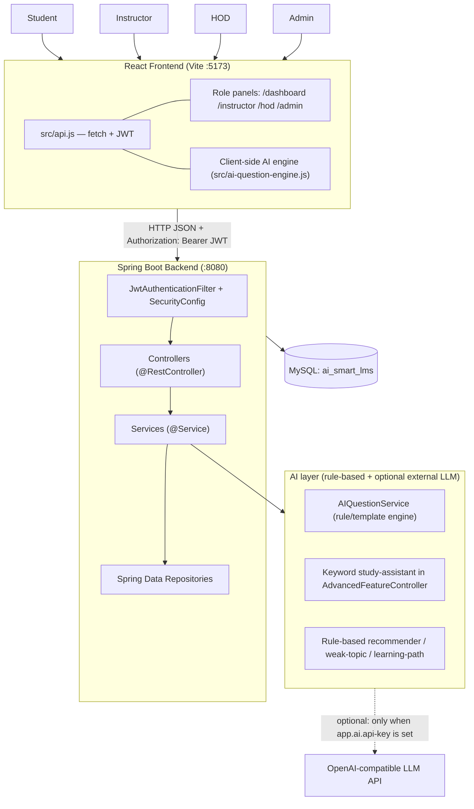
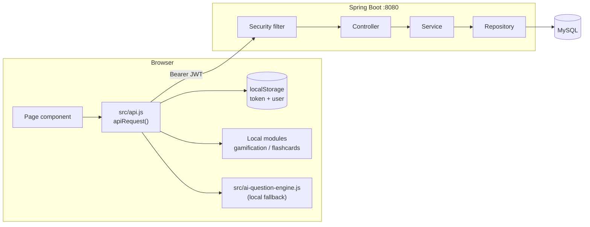
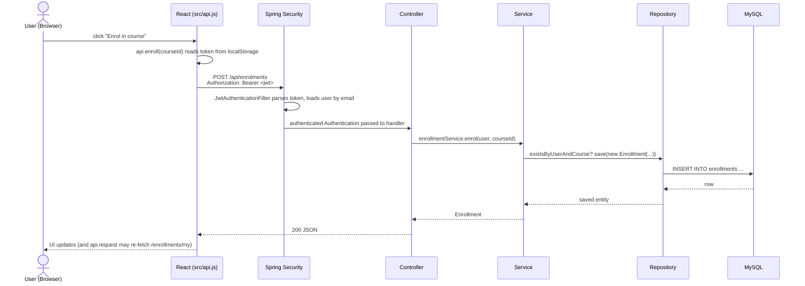
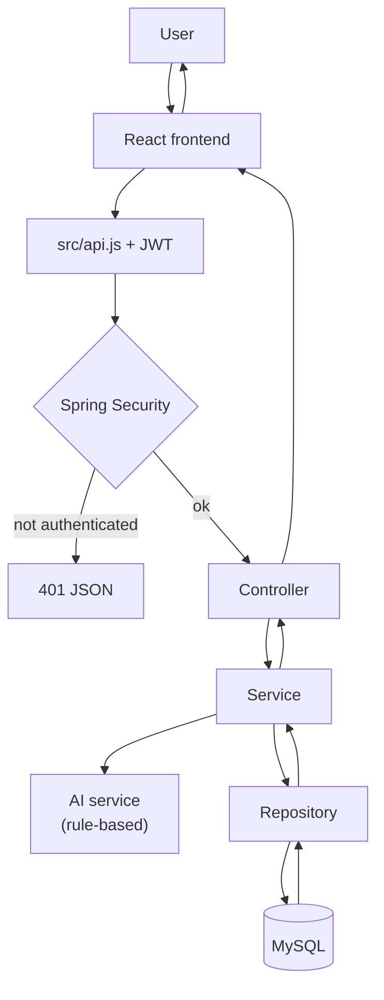
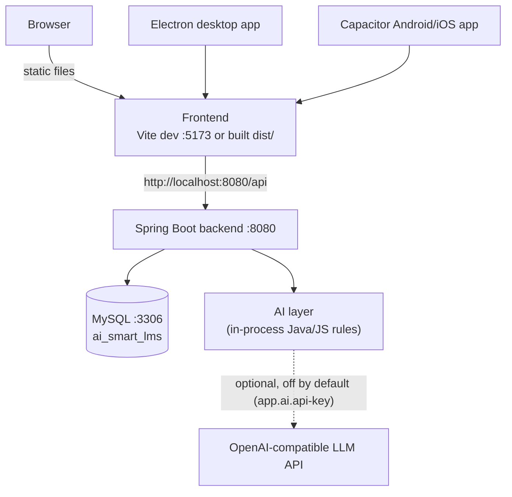

# AI-Smart-LMS — Architecture Documentation

> **Entry document for the documentation set.**
> Everything below was verified against the actual source code in this repository.
> Features that are described in text/UI but have **no code behind them** are explicitly
> marked **NOT IMPLEMENTED**. Features that only work in part are marked
> **PARTIALLY IMPLEMENTED**.

| Document | Contents |
|---|---|
| **ARCHITECTURE.md** (this file) | Overview, stack, system architecture, request flow, deployment, presentation & viva material |
| [WORKFLOWS.md](../02-Workflows/WORKFLOWS.md) | Student / Instructor / HOD / Admin / Exam / Question-Bank workflows |
| [API-DOCUMENTATION.md](../03-API/API-DOCUMENTATION.md) | Every REST endpoint actually present in the controllers |
| [DATABASE-DESIGN.md](../04-Database/DATABASE-DESIGN.md) | All JPA entities, fields, relationships, ER diagram |
| [AI-ARCHITECTURE.md](../05-AI/AI-ARCHITECTURE.md) | AI features as implemented (rule-based engines + optional external LLM mode) |
| [SECURITY.md](../06-Security/SECURITY.md) | JWT, BCrypt, CORS, role rules, security observations |
| [PROJECT-STRUCTURE.md](./PROJECT-STRUCTURE.md) | Real folder/file tree with purpose of each folder |
| [FEATURE-MATRIX.md](./FEATURE-MATRIX.md) | Feature × status × where it lives |

---

# 1. Project Overview

### Purpose

AI-Smart-LMS is a **role-based Learning Management System** for a college/university.
It lets four kinds of people work in the same system:

- **Students** — browse degree programs, enrol, study lessons, track progress, take quizzes and exams, earn certificates, and use the "AI" study helpers (offline knowledge base by default; external model answer only when the operator configures `app.ai.api-key`).
- **Instructors (Teachers)** — create courses/subjects/lessons, assignments, quizzes, exams and question papers, grade submissions, issue certificates.
- **HOD (Head of Department)** — assign instructors to courses/subjects, manage divisions and students, run a **question bank**, and **approve or reject exams** before they reach students.
- **Admin** — manage users/roles/accounts, courses and subjects, reports and platform-wide analytics.

### Main technologies (all confirmed in code)

| Layer | Technology | Purpose | Evidence in repo |
|---|---|---|---|
| Frontend | **React 19 + Vite 7** (plain JSX, no TypeScript) | SPA UI | `package.json`, `vite.config.js` |
| Routing | **react-router-dom v7** | All routes | `src/App.jsx` |
| Styling | **Plain CSS** (`src/styles.css`, `src/hod.css`, `src/roles-append.css`) | Theming | `src/main.jsx` imports |
| Icons / FX | **lucide-react**, **canvas-confetti** | UI icons, celebration effects | `package.json`, `src/utils/confetti.js` |
| 3D | **three**, **@react-three/fiber**, **@react-three/drei** | Campus tour / 3D stats / 3D badges pages | `src/pages/three/*` |
| Desktop wrapper | **Electron 44** + **electron-builder** | Windows/Mac/Linux app | `electron/main.cjs`, `package.json` |
| Mobile wrapper | **Capacitor 8** (Android/iOS) | Mobile app shell | `capacitor.config.json` |
| PWA | Service worker + manifest | Installable web app | `public/sw.js`, `public/manifest.json` |
| Backend | **Java 21 + Spring Boot 2.7.18** | REST API | `backend/pom.xml` |
| Backend frameworks | Spring Web MVC, Spring Data JPA, Spring Security, Spring Validation, Spring Actuator, DevTools | API, persistence, security | `backend/pom.xml` |
| Database | **MySQL** (`ai_smart_lms`), schema via Hibernate `ddl-auto=update` | Persistence | `backend/src/main/resources/application.properties` |
| ORM | **Hibernate / JPA** (`javax.persistence`) | Entity mapping | `backend/.../entity/*` |
| Authentication | **JWT (JJWT 0.11.5)** + **BCrypt** | Stateless login | `security/JwtService.java`, `SecurityConfig.java` |
| Build (backend) | **Maven** (`backend/mvnw` wrapper) | Build/run | `backend/pom.xml`, `backend/run.bat` |
| Tests | JUnit 5 (backend), Node test runner (frontend) | Tests | `backend/src/test/*`, `src/*.test.js` |

### Main modules (as implemented)

Authentication & accounts · Courses / Semesters / Subjects / Lessons · Academic years &
semester rows (HOD instructor-assignment scope) · Enrolment ·
Lesson progress · Quizzes + Questions + Quiz attempts · Exams + question papers + HOD approval ·
Question bank (HOD) · Instructor–course assignment (course/subject + semester + academic year) ·
Divisions & students (HOD) ·
Assignments + submissions · Attendance · Resources (file upload/download) ·
Discussions · Certificates · Notifications (in-app) · Wishlist · Reviews ·
Analytics (student/course/admin) · "AI" (assistant — rule-based or optional external LLM —,
question generator, recommender, weak topics, learning path) ·
Coding practice arena (simulated judge) ·
Gamification (client-side XP/badges/streak) · 3D showcase pages.

---

# 2. System Architecture



### What each component actually is

| Component | Simple explanation |
|---|---|
| **React frontend** | Single-page app. `src/main.jsx` mounts `src/App.jsx`, which holds *every* route. Each role gets its own shell: `StudentLayout`, `InstructorLayout`, `HODLayout`, `AdminLayout`. |
| **`src/api.js`** | The *only* place the browser talks to the server. One generic `apiRequest()` adds `Content-Type: application/json`, reads `token` from `localStorage`, sends `Authorization: Bearer <token>`, parses JSON, and turns 401 into "clear session + go to /login". Exposes a large `api` object (`api.login`, `api.myExams`, `api.hodApproveExam`, …). |
| **Spring Boot backend** | Stateless REST API on port 8080 under `/api/**`. Layered: Controller → Service → Repository → Entity → MySQL. |
| **Spring Security + JWT** | No server sessions. Every request is authenticated by decoding the Bearer token, then loading the user by e-mail from the DB. |
| **MySQL** | Database `ai_smart_lms`. Tables are created/updated automatically by Hibernate (`spring.jpa.hibernate.ddl-auto=update`); `backend/database/setup.sql` only creates the database. |
| **`DataSeeder`** | `CommandLineRunner` that seeds 10 degree programs + subjects + lessons, the default staff/student demo accounts, divisions, default instructor assignments, one `semesters` row per course semester and the previous + current `academic_years` on first start. Idempotent. |
| **AI layer** | Mostly **rule-based Java/JS logic** (keyword matching, curated question banks, template text, simple aggregates). One optional outbound path exists: `/api/ai/study-assistant` calls an **OpenAI-compatible chat-completions API** through `java.net.http.HttpClient` **only when `app.ai.api-key` is configured** (commented out in the committed `application.properties`). **No ML model and no Python service.** |
| **Electron / Capacitor** | Optional wrappers around the same built `dist/` — desktop app and Android/iOS shell. |
| **`public/sw.js`** | Service worker for PWA/offline shell. |

---

# 3. Frontend Architecture

### Entry point

```
index.html  →  src/main.jsx  →  src/App.jsx  →  role layout  →  page component
```

`src/main.jsx` also registers a React **error boundary**, loads `styles.css` then `hod.css`, and registers the service worker.

### Routing (`src/App.jsx`)

Routes are grouped by panel:

| Path prefix | Layout wrapper | Example children |
|---|---|---|
| `/login`, `/register`, `/staff-login` | none (public) | `Login`, `Register`, `StaffLogin` |
| `/dashboard`, `/courses`, `/quizzes`, `/exams`, `/assignments`, `/analytics`, `/certificates`, `/notifications`, `/wishlist`, `/leaderboard`, `/ai-assistant`, `/learning-path`, `/profile`, `/settings`, `/discussions`, `/attendance`, `/campus-tour`, `/3d-*`, `/coding`, `/subject/:id` | `Protected` → **StudentLayout** | `Dashboard`, `Courses`, `CourseDetails`, `StudentLearning`, `Quizzes`, `Exams`, `AIAssistant`, … |
| `/instructor/*` | `Protected` → **InstructorLayout** | `my-subjects`, `courses`, `courses/create`, `lessons`, `materials`, `assignments`, `coding`, `quizzes`, `exams`, `students`, `attendance`, `grades`, `analytics`, `announcements`, `discussions`, `ai-tools`, `certificates`, `calendar`, `settings` |
| `/hod/*` | `Protected` → **HODLayout** | `dashboard`, `analytics`, `assignments`, `courses`, `subjects`, `divisions`, `students`, `questions`, `exams`, `exam-approvals`, `announcements`, `settings` |
| `/admin/*` | `Protected` → **AdminLayout** | `courses`, `teachers`, `students`, `analytics`, `roles`, `subjects`, `semesters`, `lessons`, `categories`, `resources`, `quizzes`, `exams`, `assignments`, `coding`, `results`, `progress`, `certificates`, `leaderboard`, `announcements`, `discussions`, `ai-assistant`, `ai-analytics`, `ai-insights`, `reports`, `settings`, `audit-logs` |

### Authentication handling in the browser

1. `POST /api/auth/login` → response `{ token, user }`.
2. Frontend stores `token` and `user` in **`localStorage`** (`src/pages/Login.jsx`).
3. `Login.jsx` reads `response.user.role` and navigates:
   `ADMIN → /admin`, `INSTRUCTOR → /instructor`, `HOD → /hod`, otherwise `/dashboard`.
   `StaffLogin.jsx` adds a role tab (Admin/Instructor/HOD) and rejects a mismatched role.
4. Every request goes through `apiRequest()` which attaches `Bearer <token>`.
5. On **401**: `localStorage` (`token` + `user`) is cleared and the browser is redirected to `/login` (skipped while already on an auth page).
6. On **403**: the server's `error` message is thrown and shown by the page.
7. `Protected` (in `src/ui.jsx`) only checks *that a token exists*; it does **not** check the role — role enforcement is server-side.

> **Note (verified):** `src/App.jsx` also contains a large `Layout` component that is
> **defined but never used** (the active shells are the four role layouts). It references
> `useState`/`useEffect` without importing them. See SECURITY.md → *Security Observations*.

### State management

There is **no Redux/Zustand/Context store**. State comes from three places:

- **Server state** — fetched per page via `src/api.js`.
- **`localStorage`** — `token`, `user`, sidebar collapse, theme.
- **Client-side modules** — `src/gamification.js` (XP, levels, achievements, streak, badges, theme), `src/flashcards.js` (spaced-repetition cards), `src/highlight.js`, `src/dashboard.js`. All purely local; none of it is persisted to the backend.

### Frontend AI UI

| Page | What it calls |
|---|---|
| `src/pages/AIAssistant.jsx` (route `/ai-assistant`) | `api.studyAssistant(question)` → `POST /api/ai/study-assistant`; `api.generateQuestions(topic,count)` → `POST /api/ai/generate-questions`; falls back to local `generateLocalQuestions()` from `src/ai-question-engine.js` |
| `src/pages/instructor/InstructorAITools.jsx` (route `/instructor/ai-tools`) | Generates the whole question paper **in the browser** with its own local `generateQuestions()`, then `api.instructorCreateExam({ ..., questionPaper: JSON.stringify(paperData) })` |
| `src/pages/hod/HODQuestions.jsx` | `api.hodGenerateQuestions(...)` → `POST /api/hod/questions/generate` (persists into a quiz when `quizId` is given) |
| `src/pages/LearningPath.jsx` | `api.learningPath()` → `GET /api/ai/learning-path` |
| `src/pages/Analytics.jsx` | `api.recommendations()`, `api.weakTopics()`, `api.quizRecommendations()`, `api.analyticsStudent()` |
| `src/pages/admin/AdminAIAssistant.jsx` / `AdminAIAnalytics.jsx` / `AdminAIInsights.jsx` | Admin panels over the same rule-based endpoints and local presentation logic |



### Actual frontend folder structure (important parts)

```
src/
├── main.jsx              # mount, error boundary, CSS order, service worker
├── App.jsx               # ALL routes + role layouts
├── api.js                # single API layer (fetch + JWT + 401/403 handling)
├── ui.jsx                # getStoredUser, Protected, Page, Loading, Empty
├── gamification.js       # local XP / badges / streak / theme
├── ai-question-engine.js # local rule-based question generator (fallback)
├── flashcards.js         # local flashcard store
├── dashboard.js          # dashboard empty-state helper
├── highlight.js          # keyword highlight segments
├── mockCodingData.js     # offline coding problems
├── styles.css / hod.css / roles-append.css
├── components/
│   ├── student/  (StudentLayout, StudentSidebar, StudentMobileHeader, menu config)
│   ├── instructor/ → pages/instructor/InstructorLayout.jsx
│   ├── hod/      (HODLayout, HODSidebar)
│   ├── admin/    (AdminLayout, AdminSidebar, menu config)
│   ├── CommandPalette, Toast, CertificateGenerator, ProgressRing,
│   │   LearningHeatmap, StudyPlanner, StudyStreak
├── pages/                # student-level pages
├── pages/instructor/     # instructor panel
├── pages/hod/            # HOD panel
├── pages/admin/          # admin panel
├── pages/three/          # 3D scenes (three.js)
└── utils/confetti.js
```

---

# 4. Backend Architecture

### Main application class

`backend/src/main/java/com/aismartlms/backend/BackendApplication.java` (standard Spring Boot entry point).

### Package structure (actual)

```
com.aismartlms.backend
├── BackendApplication.java
├── config/
│   └── DataSeeder.java              # seeds degrees, subjects, lessons, demo users, divisions, assignments
├── controller/                      # 19 @RestController classes + 1 @RestControllerAdvice
├── dto/                             # AuthResponse, LoginRequest, RegisterRequest, ExamSubmissionRequest,
│                                    # QuizSubmissionRequest, HODDashboardView, DivisionRequest/Response, ...
├── entity/                          # 29 JPA entities + Role enum
├── exception/
│   └── AccessDeniedException.java   # → HTTP 403 via ApiExceptionHandler
├── repository/                      # 29 Spring Data JpaRepository interfaces
├── security/
│   ├── SecurityConfig.java          # filter chain, CORS, BCrypt, UserDetailsService, public endpoints
│   ├── JwtAuthenticationFilter.java # OncePerRequestFilter: Bearer → SecurityContext
│   └── JwtService.java              # create/parse/validate JWT (HS256, 24 h)
└── service/                         # 19 @Service classes
```

### Controllers (19 `@RestController` + 1 `@RestControllerAdvice`)

| Controller | Base path | Responsibility |
|---|---|---|
| `AuthController` | `/api/auth` | register, instructor self-signup, login, refresh |
| `UserController` | `/api/user` | `/profile` |
| `AdvancedFeatureController` | `/api` | dashboard, search/filter, profile, wishlist, reviews, instructor dashboard, course status, certificates, notifications, admin dashboard/users/reports, forgot/reset password, analytics, all `/ai/*`, continue-learning, quiz-attempts, reminders |
| `CourseController` | `/api/courses` | plain CRUD on courses |
| `CourseManagementController` | `/api` | degree programs, semesters, subjects, lessons, instructor & admin course management, `GET /api/academic-years` |
| `LessonController` | `/api/lessons` | lesson CRUD |
| `EnrollmentController` | `/api/enrollments` | enrol / my enrolments |
| `ProgressController` | `/api/progress` | start/update/list lesson progress |
| `QuizController` | `/api/quizzes` | quiz CRUD (course-scoped) |
| `QuestionController` | `/api/questions` | question CRUD (course-manage gated) |
| `QuizAttemptController` | `/api/quiz-attempts` | submit quiz, list attempts |
| `ExamController` | `/api/exams` | exam CRUD, submit-for-approval, publish, override status, student submission & grading |
| `HODController` | `/api/hod` | HOD dashboard, assignments, courses/subjects/instructors/students, question bank, exam approvals, announcements, divisions |
| `AssignmentController` | `/api/assignments` | assignments + submissions + grading |
| `AttendanceController` | `/api/attendance` | mark & read attendance |
| `ResourceController` | `/api/resources` | upload/download/list course resources |
| `DiscussionController` | `/api/discussions` | threads, replies, likes, "solve" |
| `InstructorCertificateController` | `/api/instructor/certificates` | stats, eligibility, generate, revoke, verify |
| `CodingPracticeController` | `/api/coding` | problems, run/submit, submissions, `ai-assist`, admin problem CRUD |
| `ApiExceptionHandler` | `@RestControllerAdvice` | `RuntimeException` → **400**, `AccessDeniedException` → **403** |

### Services (19 `@Service` classes in `service/`)

`AuthService` · `CourseService` · `EnrollmentService` · `ProgressService` · `LessonService` ·
`QuestionService` · `QuizAttemptService` · `ExamService` · **`ExamApprovalService`** ·
**`HODService`** · **`InstructorAccessService`** · `AIQuestionService` · `AssignmentService` ·
`AttendanceService` · `ResourceService` · `FileStorageService` · `DiscussionService` ·
`InstructorCertificateService` · `CodingPracticeService` · plus `JwtService` in `security/`.

### Actual request flow

```
React page
   ↓  api.requestX()                src/api.js
   ↓  fetch("http://localhost:8080/api/...", { headers: { Authorization: "Bearer <jwt>" } })
   ↓
Spring Security filter chain
   ├─ CORS check
   ├─ JwtAuthenticationFilter → JwtService.extractEmail() → UserRepository.findByEmail()
   │      → SecurityContext authorities = ROLE_<Role>
   └─ endpoint authorization (permitAll list, else authenticated)
   ↓
@Controller method            (some enforce a role / course assignment here)
   ↓
@Service business logic       (validation, workflow state machine, grading, rule-based "AI")
   ↓
JpaRepository (Spring Data)   (derived queries + @Query JPQL)
   ↓
MySQL (ai_smart_lms)
   ↓
JSON response → apiRequest() → page state → re-render React
```

**Important design rule present in this codebase:** the React UI only *hides* buttons.
Every exam-workflow and instructor-assignment decision is re-made on the server
(`ExamApprovalService`, `InstructorAccessService`) so a hand-crafted HTTP request cannot skip the HOD.

---

# 5. Database Architecture

Full detail lives in [DATABASE-DESIGN.md](../04-Database/DATABASE-DESIGN.md). Summary:

- **29 JPA entities** + `Role` enum, mapped to MySQL tables (snake_case names declared with `@Table`).
- Schema is produced by **`spring.jpa.hibernate.ddl-auto=update`** — no Flyway/Liquibase migration files.
- `backend/database/setup.sql` only creates the empty database and documents the seeder.

Headline relationships (verified in the entity sources):

| Relationship | Where |
|---|---|
| `Course 1—* Lesson` | `Course.lessons` mappedBy `lesson.course`, cascade ALL |
| `Course 1—* Subject` | `Course.subjects` mappedBy `subject.course` |
| `Subject 1—* Lesson` | `Subject.lessons` mappedBy `lesson.subject` (optional FK) |
| `Course 1—* Quiz`, `Quiz 1—* Question` | `Quiz.questions` mappedBy `question.quiz` |
| `Course 1—* Exam` | `Exam.course` `@ManyToOne` |
| `User 1—* Enrollment *—1 Course` | `Enrollment` join table semantics |
| `User 1—* Progress *—1 Lesson` | `Progress` |
| `User 1—* Wishlist *—1 Course` | unique `(user_id, course_id)` |
| `User 1—* Review *—1 Course` | unique `(user_id, course_id)` |
| `User 1—* Certificate *—1 Course` | `Certificate` |
| `User → Course` (degree) and `User → Division` | `User.course`, `User.division` |
| `Division *—1 Course`, `Division *—1 User(classTeacher)` | `Division` |
| `Assignment 1—* AssignmentSubmission`, `Submission *—1 User` | assignments |
| `Discussion 1—* DiscussionReply` | discussions |
| `CodingProblem 1—* CodingTestCase`, `CodingProblem 1—* CodingSubmission` | coding arena |

**Note:** `Exam` also declares `@OneToMany(mappedBy = "quiz") List<Question> questions`, i.e. it re-uses the `questions.quiz_id` column. Exam *grading*, however, never reads those rows — it flattens `Exam.questionPaper` (a JSON `TEXT` column). See DATABASE-DESIGN.md → *Data Observations*.

---

# 6. Authentication & Security (summary)

Full detail in [SECURITY.md](../06-Security/SECURITY.md).

**Roles found in the code:** `Role` enum = `STUDENT`, `INSTRUCTOR`, `HOD`, `ADMIN` (exactly four).

**Registration** — `POST /api/auth/register` always creates `Role.STUDENT` (the client-supplied role is ignored), BCrypt-hashes the password, auto-enrols the student in the chosen degree course, and returns a JWT. `POST /api/auth/register/instructor` creates an **inactive** `INSTRUCTOR` that an admin must activate.

**Login** — e-mail lookup → `active` check → `BCryptPasswordEncoder.matches()` → `JwtService.generateToken(email)` (HS256, subject = e-mail, **24 h** expiry) → response `{ message, token, user:{id,name,email,role,...} }`.

**Per request** — `JwtAuthenticationFilter` reads `Authorization: Bearer …`, extracts the e-mail, reloads the user, sets authority `ROLE_<Role>`, and continues. Invalid tokens are swallowed (request proceeds unauthenticated → 401 from the entry point).

**Public endpoints** (from `SecurityConfig`): `/api/auth/register`, `/api/auth/register/instructor`, `/api/auth/login`, `/api/courses`, `/api/courses/*/semesters`, `/api/courses/*/subjects`, `/api/courses/*/subjects/*`, `/actuator/**`. **Everything else requires a JWT.**

---

# 7. Complete Request Flow



### Stage by stage

1. **User** triggers a handler in a page component.
2. **React** calls a method on the `api` object in `src/api.js`.
3. **API layer** builds `http://localhost:8080/api + endpoint`, adds JSON headers and `Authorization: Bearer <token>` (token from `localStorage`), performs `fetch`, reads text, parses JSON.
4. **JWT** travels in the header — never in a cookie (no sessions; `SessionCreationPolicy.STATELESS`).
5. **Spring Security** — CORS → CSRF disabled → `JwtAuthenticationFilter` → authorization rules (`permitAll` list or `authenticated`).
6. **Controller** — resolves the current user (`me(authentication)` / `access.requireCurrentUser()`), applies role or course-assignment rules, binds the body.
7. **Service** — business rules, workflow state transitions, grading, rule-based "AI".
8. **Repository** — Spring Data derived queries / `@Query` JPQL.
9. **MySQL** — returns rows.
10. **Response** — JSON back through the same path; `apiRequest()` maps 401 → logout+redirect, 403 → thrown message.

### One normal LMS request (data-flow view)



---

# 8. Deployment Architecture



### Development environment (values taken from the actual config)

| Item | Actual value | Source |
|---|---|---|
| Frontend dev port | **5173** | `vite.config.js` → `server.port` |
| Backend port | **8080** | `application.properties` → `server.port=8080` |
| API base URL in browser | `http://localhost:8080/api` | `src/api.js` → `API_URL` |
| DB URL | `jdbc:mysql://localhost:3306/ai_smart_lms` | `application.properties` |
| DB user / password | `root` / `Rocky.2004#` (**hard-coded**) | `application.properties` |
| Schema strategy | `spring.jpa.hibernate.ddl-auto=update` | `application.properties` |
| SQL logging | `spring.jpa.show-sql=true`, `format_sql=true` | `application.properties` |
| File upload dir | `app.upload.dir=uploads/resources`, max 50 MB | `application.properties` |
| Data seeding toggle | `app.seed-data:true` (default) | `DataSeeder` |
| External AI mode (off by default) | `# app.ai.api-key`, `# app.ai.base-url=https://api.openai.com/v1`, `# app.ai.model=gpt-4o-mini` (all commented out) | `application.properties` → read by `AdvancedFeatureController` |
| Electron dev URL | `http://localhost:5173` | `electron/main.cjs` |
| Capacitor web dir | `dist`, appId `com.aismartlms.app` | `capacitor.config.json` |

### Environment variables

**None are read from the environment.** There is no `.env` file usage for the backend and no
`System.getenv`/`${...}` externalised secrets — DB credentials and the JWT secret are literal
constants in the source. This is recorded as an observation in SECURITY.md, not changed here.

### Build & run commands (actual scripts from `package.json` / `backend/`)

```bash
# ---- Frontend ----
npm install
npm run dev            # vite dev server → http://localhost:5173
npm run build          # production bundle → dist/
npm run preview        # preview the built bundle
npm test               # node --test "src/**/*.test.js"

npm run electron:dev   # vite build && electron .
npm run electron:build # vite build && electron-builder → release/
npm run cap:sync       # capacitor sync (after npm run build)

# ---- Backend ----
cd backend
./mvnw spring-boot:run    # macOS/Linux
run.bat                   # Windows (calls mvnw.cmd spring-boot:run)
./mvnw test               # JUnit tests
./mvnw package            # jar
```

Prerequisites: **Node 18+**, **JDK 21**, **Maven wrapper** (bundled), **MySQL 8** with an empty
database named `ai_smart_lms`.

> There is **no CI workflow file** in `.github/` and **no Docker/Kubernetes/Procfile** in the repo.
> Deployment today = run MySQL, run the Spring Boot jar, serve `dist/` (or use `npm run dev`).

---

# 9. Feature Status Snapshot

Full table in [FEATURE-MATRIX.md](./FEATURE-MATRIX.md).

| Area | Status |
|---|---|
| Auth (JWT + BCrypt), 4 roles, instructor self-signup w/ admin activation | **IMPLEMENTED** |
| Courses / semesters / subjects / lessons, enrolment, progress | **IMPLEMENTED** |
| Quizzes, questions, quiz attempts (persisted) | **IMPLEMENTED** |
| Exam CRUD + **HOD approval state machine** + publish gate | **IMPLEMENTED** |
| Exam question paper (JSON `TEXT`) + server-side grading | **IMPLEMENTED** |
| **Exam result persistence** (history per student) | **NOT IMPLEMENTED** — grading returns a map, nothing is saved |
| Question bank (HOD) | **PARTIALLY IMPLEMENTED** — reads `questions` table, `type`/`difficulty`/`status` are hard-coded placeholders |
| Instructor↔course assignment (HOD), scoped by course/subject + semester + academic year | **IMPLEMENTED** |
| Academic structure (`semesters`, `academic_years` tables + HOD endpoints) | **IMPLEMENTED** |
| Divisions & student assignment (HOD) | **IMPLEMENTED** |
| Certificates (student self-issue after 100% progress; instructor generate/revoke/verify) | **IMPLEMENTED** |
| Notifications | **PARTIALLY IMPLEMENTED** — in-app rows only (certificates, reminders, test endpoint). No email/push/WS. |
| Wishlist / reviews / discussions / assignments / attendance / resources | **IMPLEMENTED** |
| Analytics (student, course, admin) | **IMPLEMENTED** (SQL/aggregate based) |
| "AI" assistant, question generator, recommendations, weak topics, learning path | **IMPLEMENTED** — question generator / recommendations / weak topics / learning path are rule-based; the study assistant additionally calls an external OpenAI-compatible LLM **only when `app.ai.api-key` is configured** (off in the committed config) |
| Python FastAPI AI service (claimed in a UI footer) | **NOT IMPLEMENTED** — no `ai-service/` folder, no Python code |
| External LLM call | **IMPLEMENTED but off by default** — `POST /api/ai/study-assistant` calls an OpenAI-compatible `/chat/completions` endpoint only when `app.ai.api-key` is set; committed config leaves it commented out (`mode:"simple-ai"`) |
| Voice assistant / speech input | **NOT IMPLEMENTED** — no mic or speech code |
| TensorFlow / ML model | **NOT IMPLEMENTED** (only mentioned inside answer text) |
| Forgot/reset password | **PARTIALLY IMPLEMENTED** — token created and *returned in the response* ("Demo mode"); no email is sent; endpoints are also behind JWT auth |
| Coding arena "code execution" | **PARTIALLY IMPLEMENTED** — simulated/interpreted runner, not a real sandboxed compiler |

---

# 10. Quick Project Explanation (≈ 2 minutes)

> "AI-Smart-LMS is a role-based Learning Management System built as a **React + Vite single-page
> application** on top of a **Java 21 Spring Boot REST API** and a **MySQL** database.
>
> There are four roles — **Student, Instructor, HOD and Admin** — each with its own panel and its
> own sidebar. Login is **stateless JWT**: the server hashes passwords with **BCrypt**, issues a
> 24-hour token, and every subsequent request carries `Authorization: Bearer <token>`. The Spring
> Security filter loads the user from the database on each request, so no server session exists.
>
> On the data side there are **29 JPA entities** covering degree courses, semesters, subjects,
> lessons, enrolment, progress, quizzes, questions, exams, assignments, attendance, discussions,
> certificates, divisions and more. The schema is generated by Hibernate from the entities.
>
> The academic core is the **exam approval workflow**: an instructor creates an exam in `DRAFT`,
> adds or generates a question paper, and submits it for approval. It moves to
> `PENDING_HOD_APPROVAL`; the HOD reviews the full paper and either **approves** it or **rejects
> it with a mandatory reason**. Only an approved exam can be **published**, and only published
> exams are visible to students. The state machine, the department scope and the "nobody approves
> their own exam" rule are all re-enforced **on the server**, not just hidden in the UI.
>
> The "AI" features are split in two. The **study assistant** has two modes: with
> `app.ai.api-key` configured it forwards the question to an OpenAI-compatible chat-completions
> API (server-side key, 25-second timeout) and returns `"mode": "ai"`; with the committed
> configuration — key commented out — it, and any failed call, falls back to a built-in
> keyword knowledge base and returns `"mode": "simple-ai"`. The **question generator,
> recommendations, weak-topic detector and learning path** are **rule-based Java and JavaScript
> logic** working on real student data: curated question banks, keyword matching and simple
> aggregates. All of them sit behind `AIQuestionService` and the `/api/ai/*` endpoints, so the
> key — if an operator adds one — stays only on the Spring Boot side.
>
> Finally, the same frontend also ships as an **Electron desktop app**, an **Android/iOS
> Capacitor app** and a **PWA**, because they all wrap the same built bundle."

---

# 11. 10-Minute Technical Explanation

### 1. Architecture (≈ 1 min)
Three tiers. **Tier 1 — browser**: React 19 SPA built by Vite, routes for four role panels.
**Tier 2 — application**: Spring Boot 2.7 REST API on port 8080, layered
`Controller → Service → Repository`, secured by a JWT filter. **Tier 3 — data**: MySQL database
`ai_smart_lms`, schema from Hibernate `ddl-auto=update`, seeded by a `CommandLineRunner`.
There is no message queue, no cache layer, no separate AI microservice — everything runs inside
one JVM process, which is why the system is simple to run.

### 2. Frontend (≈ 1 min)
`index.html → main.jsx → App.jsx`. Routing is file-level in `App.jsx`: `StudentLayout`,
`InstructorLayout`, `HODLayout`, `AdminLayout`, each wrapped in `Protected`.
All network access is funnelled through **one file**, `src/api.js`, whose `apiRequest()`
adds JSON headers, attaches the Bearer token from `localStorage`, parses the response and
converts 401 into "clear session + redirect to /login" and 403 into a readable message.
There is no global store; server data is fetched per page and gamification/flashcards are kept
locally in `localStorage`.

### 3. Backend (≈ 1 min)
19 controllers, 19 services (+ `JwtService`), 29 repositories, 29 entities, one `@RestControllerAdvice`
exception handler (`RuntimeException → 400`, `AccessDeniedException → 403`).
Two service classes carry the domain rules: **`ExamApprovalService`** (exam state machine) and
**`InstructorAccessService`** (which instructor may manage which course/subject).
`DataSeeder` creates 10 degree programs with subjects and lessons, the demo accounts, divisions,
default assignments, per-course semester rows and the current academic years on first start.

### 4. Database (≈ 1 min)
Everything hangs off **`Course`** — a degree program (BCA, MBA, …) that owns **`Subject`** rows per
semester and **`Lesson`** rows. Students link to a degree via `User.course` and to a section via
`User.division`. Learning state is stored as `Enrollment` (user×course) and
`Progress` (user×lesson, with `progressPercentage` and `completed`). Assessment splits into
`Quiz → Question` (MCQ, four fixed options, correct answer, marks) and `Exam` (duration, marks,
passing marks, negative marking, schedule, workflow status, plus a JSON `questionPaper` column).
Side modules: `Assignment/AssignmentSubmission`, `Attendance`, `Resource`, `Discussion/DiscussionReply`,
`Certificate`, `Notification`, `Wishlist`, `Review`, `Announcement`, `InstructorCourseAssignment`
(course/subject + semester + academic year, all plain FKs), `Semester`, `AcademicYear`,
`Division`, and `CodingProblem/CodingTestCase/CodingSubmission`.

### 5. Authentication (≈ 1 min)
`POST /api/auth/register` forces `Role.STUDENT`, ignores any client role, BCrypt-hashes the
password, auto-enrols the student and returns a JWT. `POST /api/auth/login` checks the account is
`active`, verifies the hash, and returns a 24-hour HS256 token whose subject is the e-mail plus a
`user` object containing the role. Each request is processed by `JwtAuthenticationFilter`:
extract e-mail → load user → set authority `ROLE_<Role>` → continue. Sessions are disabled.
Only the register/login endpoints and the public course catalogue are `permitAll`.

### 6. Roles (≈ 1 min)
`STUDENT`, `INSTRUCTOR`, `HOD`, `ADMIN`. Authorisation is **not** declared as URL patterns —
it is enforced inside the controllers/services: `role(user, Role.ADMIN)`, `requireHOD()`,
`requireHODOrAdmin()`, `requireCourseManage(courseId)`. Practical rules: admins manage users,
courses, subjects, lessons, reports and can override any exam status; HODs approve/reject exams
for their department, assign instructors, manage divisions and the question bank; instructors
manage only the courses assigned to them and only their own exams; students read published
content and submit their own work.

### 7. Student workflow (≈ 1 min)
Register (choose degree) → auto-enrol → dashboard (`GET /api/dashboard`) → browse/search/filter
courses → study a lesson (`POST /api/progress/lesson/{id}`) → progress percentage and
"continue learning" update → take a quiz (`POST /api/quiz-attempts/submit`, graded server-side,
stored as `QuizAttempt`) → see weak topics and recommendations from `/api/ai/*` → take a
published exam (`POST /api/exams/{id}/submit`, graded against the paper inside its time slot) →
when all lessons are complete, claim a certificate (`POST /api/certificates/course/{courseId}`),
which also creates an in-app notification.

### 8. Instructor workflow (≈ 1 min)
Instructor signs up (inactive) or is created by an admin → HOD assigns them to a course/subject →
they create courses (`POST /api/instructor/courses`), subjects and lessons, assignments,
attendance, resources and quizzes with questions → they build an exam, which is **forced to
`DRAFT`** with `createdBy` recorded → they can either compose questions or use **AI Tools** to
generate a full paper in the browser and upload it as `questionPaper` →
`POST /api/exams/{id}/submit-for-approval` → then they wait for the HOD. Publishing is only
possible once the status is `APPROVED`.

### 9. HOD workflow (≈ 1 min)
`GET /api/hod/exam-approvals` lists the department's pending papers (department = the course on
the HOD's profile) → `GET /api/hod/exam-approvals/{id}` returns the **full question paper** →
`POST .../approve` moves it to `APPROVED` and records approver name and timestamp, or
`POST .../reject` with a **mandatory reason** moves it to `REJECTED`, which the instructor sees
as feedback and can edit and resubmit. Server rules: only HOD/ADMIN may decide, only inside the
HOD's department, and **no one may approve their own exam**. Elsewhere the HOD also assigns
instructors, manages divisions and students, and generates questions into the question bank.

### 10. AI architecture (≈ 1 min)
Four server endpoints under `/api/ai/*` plus `/api/hod/questions/generate` and
`/api/coding/ai-assist`. `AIQuestionService` first serves **curated** question sets for known
topics (OOP, Java, Python, DBMS, DSA, networks, OS, web) and then **algorithmically fills** the
remainder up to the requested count. The **study assistant** has two modes: an outbound call to
an OpenAI-compatible `chat/completions` API when `app.ai.api-key` is set (`mode:"ai"`), and
otherwise a keyword router over canned answers (`mode:"simple-ai"`) — that is what the committed
config does. **Recommendations**, **weak topics** and the **learning path** are computed from the
student's own enrolments, progress and quiz percentages. The frontend has a matching local
engine used as an offline fallback. **No ML model and no Python service are involved.**
AI-ARCHITECTURE.md documents the exact request flow and configuration.

---

# 12. Viva Questions & Answers (25 + 1 bonus, based on this project)

**1. What is the tech stack of your project?**
React 19 + Vite 7 SPA, Spring Boot 2.7.18 on Java 21, MySQL with Hibernate/JPA, JWT + BCrypt security; Electron/Capacitor wrap the same frontend for desktop/mobile.

**2. How many roles does your system have and what are they?**
Four, defined in `entity/Role.java`: `STUDENT`, `INSTRUCTOR`, `HOD`, `ADMIN`.

**3. How does login work?**
`POST /api/auth/login` finds the user by e-mail, checks `active`, matches the BCrypt hash, then `JwtService.generateToken(email)` returns a 24-hour HS256 JWT plus a `user` object containing the role.

**4. Where is the JWT stored on the client?**
In `localStorage` under the key `token` (with `user` alongside), read by `src/api.js` and sent as `Authorization: Bearer <token>`.

**5. Why is the session stateless?**
`SessionCreationPolicy.STATELESS` — no server session; each request is re-authenticated by `JwtAuthenticationFilter`, which scales horizontally and keeps the API reusable by the mobile/desktop shells.

**6. How are passwords stored?**
BCrypt via `BCryptPasswordEncoder` — a salted, adaptive hash; the raw password is never stored or returned (`@JsonProperty(Access.WRITE_ONLY)` on `User.password`).

**7. What happens when a JWT is missing or expired?**
The filter leaves the request unauthenticated; `SecurityConfig`'s `AuthenticationEntryPoint` returns **401 with a JSON body**, and the frontend clears `token`/`user` and redirects to `/login`.

**8. Which endpoints are public?**
`/api/auth/register`, `/api/auth/register/instructor`, `/api/auth/login`, the course catalogue patterns (`/api/courses`, `/api/courses/*/semesters`, `/api/courses/*/subjects`, `/api/courses/*/subjects/*`) and `/actuator/**`. Everything else requires a JWT.

**9. Can a student register themselves as an admin?**
No. `AuthService.register()` always sets `Role.STUDENT` and explicitly ignores any client-supplied role.

**10. How does an instructor account get created?**
Either an admin creates it (`POST /api/admin/users`) or the instructor self-signs up via `POST /api/auth/register/instructor`, which creates the account **inactive**; the admin must activate it before login is possible.

**11. What is the exam approval workflow?**
`DRAFT → PENDING_HOD_APPROVAL → APPROVED → PUBLISHED`, with `REJECTED` as a side branch that the instructor can edit and resubmit. Constants live in `ExamApprovalService`.

**12. Who can approve an exam?**
Only `HOD` or `ADMIN` (`requireApprover`), only for a course inside the HOD's department (`requireDepartmentScope`), and **never your own exam** (`requireNotSelfApproved`).

**13. What happens if the HOD rejects an exam?**
Status becomes `REJECTED` and `rejectionReason` must be non-empty; the instructor sees it as "HOD Feedback", edits the paper and calls submit-for-approval again, which clears the old reason.

**14. Can an instructor publish an exam without approval?**
No. `ExamApprovalService.publish()` throws `AccessDeniedException` → HTTP 403 "Exam must be approved by HOD before publishing."

**15. How does the backend know which courses an instructor may manage?**
`InstructorAccessService` checks for an `ACTIVE` `InstructorCourseAssignment` row created by the HOD (course-level or subject-level). Staff (HOD/ADMIN) bypass the check; students never pass.

**16. Is the React UI the only place these rules exist?**
No — that is an explicit design comment in the code: the UI merely hides buttons; `ExamApprovalService` and `InstructorAccessService` re-check every transition server-side.

**17. How is a quiz graded?**
`QuizAttemptService.submitQuiz()` compares each answer case-insensitively with `Question.correctAnswer`, sums marks, computes a percentage, passes at ≥ 40 %, and persists a `QuizAttempt` row.

**18. How is an exam graded?**
`ExamService.gradeSubmission()` flattens the JSON in `Exam.questionPaper` (`sections[].questions[]` or `questions[]`), grades only MCQ items that have an answer key, applies negative marking, counts descriptive questions as `pendingManual`, and only accepts the submission while `startTime ≤ now ≤ endTime`.

**19. Are exam results saved in the database?**
**No** — this is a known gap. The grade map is returned to the browser, but there is no exam-attempt entity, so results are not persisted (quiz attempts, by contrast, are).

**20. What is the "question bank"?**
A HOD-facing view over the `questions` table (`GET /api/hod/questions`) plus AI generation into a chosen quiz (`POST /api/hod/questions/generate`). Questions themselves always belong to a `Quiz` — there is no standalone bank entity.

**21. How does AI question generation work?**
`AIQuestionService.generateQuestions(topic, count)` matches the topic to curated banks (OOP, Java, Python, DBMS, DSA, networks, OS, web), de-duplicates, then algorithmically fills the remaining count up to 200. It is **template/rule-based, not an ML model**.

**22. Is an external LLM integrated?**
Partially — and only for one endpoint. `POST /api/ai/study-assistant` calls any OpenAI-compatible
`/chat/completions` API (`app.ai.base-url`, `app.ai.model`, `app.ai.api-key`) when a key is
configured; the committed `application.properties` leaves all three commented out, so out of the
box the assistant answers from its built-in keyword knowledge base with `"mode":"simple-ai"`.
No ML model and no Python service exist in the repository. Details in AI-ARCHITECTURE.md.

**23. What does "AI recommendation / weak topic / learning path" actually do?**
It aggregates the student's own data: recommendations rank un-enrolled approved courses by keyword overlap with the lowest-scoring quiz; weak topics list attempts below 60 %; the learning path lists approved courses marked COMPLETED when every lesson has `completed = true`.

**24. How does the frontend know which panel to show?**
After login the role from the response decides the redirect (`/admin`, `/instructor`, `/hod`, `/dashboard`), and each panel is a separate layout route. `Protected` only verifies a token exists; the real authorisation is enforced by the API.

**25. How is the database schema created?**
Hibernate `spring.jpa.hibernate.ddl-auto=update` generates/alters tables from the 29 `@Entity` classes; `backend/database/setup.sql` only creates the `ai_smart_lms` database, and `DataSeeder` populates degrees, subjects, lessons, demo users, divisions, default assignments, course semesters and academic years idempotently.

**26 (bonus). What is unique about how the frontend handles the backend being offline?**
`src/api.js` tracks a `_backendDown` flag after a failed connectivity probe; `safeApiRequest()` then returns `null` so pages render with local/mock fallbacks (e.g. mock divisions), while `strictApiRequest()` still rethrows genuine 4xx errors so the user sees the real message.

---

*Generated from source inspection only — no application code, database, API or authentication behaviour was modified.*
