# AI-Smart-LMS — Workflows

Every workflow below was traced through the actual source files named in each section.
Anything not backed by code is labelled **PLANNED / NOT IMPLEMENTED** or **PARTIALLY IMPLEMENTED**.

---

## 0. Master workflow (whole system)

```
                        AI-SMART-LMS
                              |
        +---------------------+---------------------+
        |                     |                     |
     STUDENT              INSTRUCTOR                ADMIN
        |                     |                     |
   Browse/Enrol          Create course          Manage users
        |                Lessons/Quizzes             |
   Study lessons         Assignments/Exams      Approve accounts
        |                     |                  Reports
   Track progress        Question paper             |
        |                     |                Course/Subject CRUD
   Quiz attempts         Submit for approval
        |                     |
   Published exams  <--- HOD approve/reject
        |                     |
   Results*             Publish to students
        |
   Certificate                  +
        |                       |
        +---------- AI ------------------+
                     |             |
                   Text         Question bank
             study-assistant    generate-questions
             (offline KB or     ai-assist (coding)
              optional external
              LLM when
              app.ai.api-key set)
             recommendations
             weak-topics
             learning-path

   * exam results are computed and returned but NOT persisted
```

---

## 1. Authentication workflows

### 1.1 Student registration — `POST /api/auth/register` (`AuthService.register`)

```mermaid
flowchart TD
    A[User fills Register form] --> B[POST /api/auth/register]
    B --> C{Email already exists?}
    C -->|yes| D[400: Email already registered]
    C -->|no| E{Phone valid?<br/>7-15 digits, digits + - space only (optional field)}
    E -->|invalid| F2[400 Invalid phone number]
    E -->|ok| E2{confirmPassword given?}
    E2 -->|mismatch| F[400: passwords do not match]
    E2 -->|ok| G{courseId given?}
    G -->|course missing| H[400: Course not found]
    G -->|ok/none| I["set Role = STUDENT<br/>(client role is IGNORED)"]
    I --> J[BCrypt encode password]
    J --> K[Save User]
    K --> L{enrolled in degree course?}
    L -->|yes| M[Save Enrollment row]
    M --> N[Generate JWT]
    L -->|no course| N
    N --> O[201 {token, user}]
```

**Key rule (verified):** public self-registration can **only** create `STUDENT` accounts.

### 1.2 Instructor self-signup — `POST /api/auth/register/instructor`

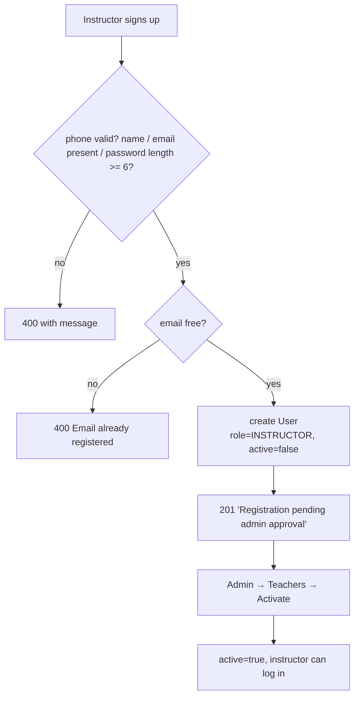

No JWT is issued at signup because an inactive account cannot log in.

### 1.3 Login — `POST /api/auth/login`

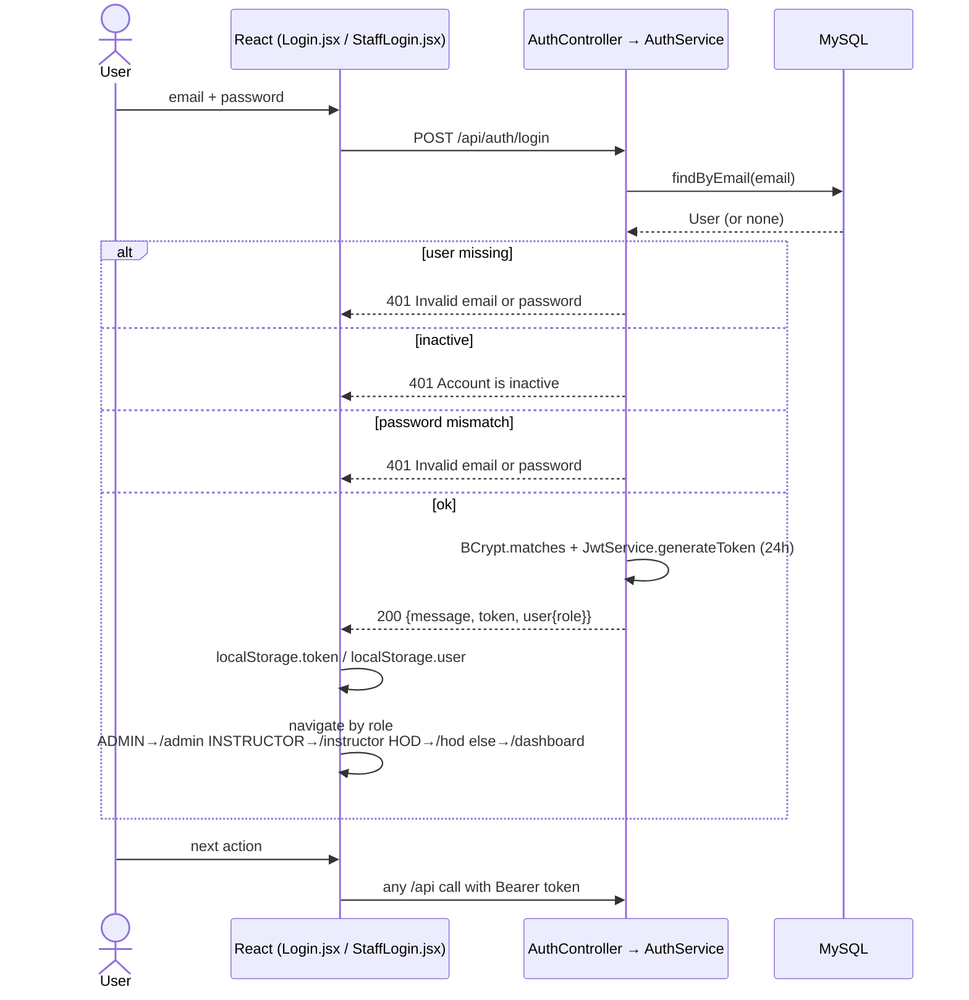

### 1.4 Per-request authentication (every protected call)

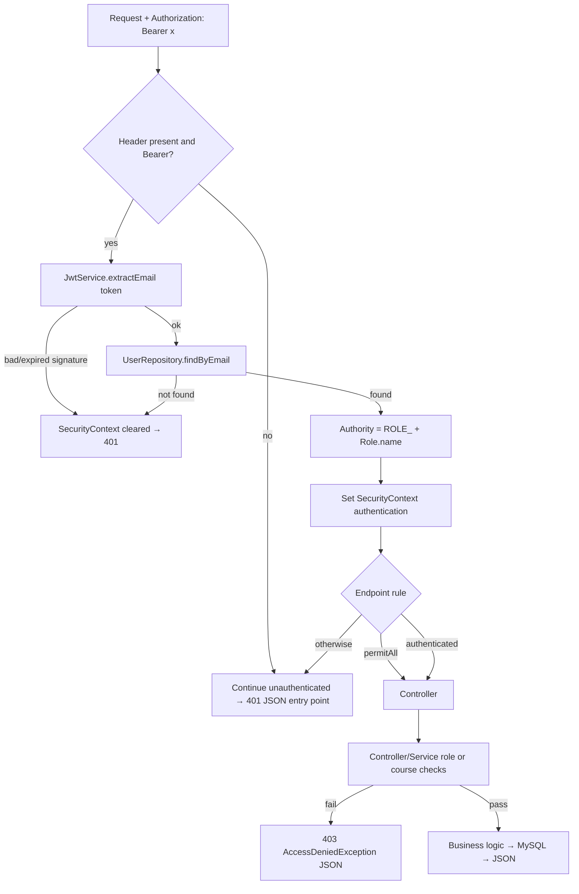

---

## 2. Student workflow

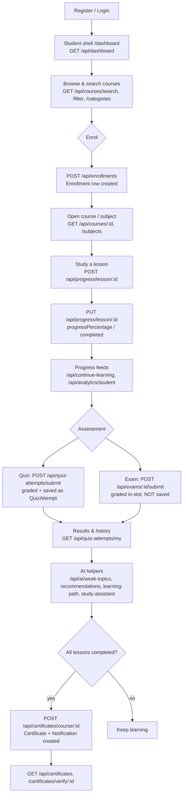

### Supporting student features (all implemented)

| Feature | Endpoint(s) | Notes |
|---|---|---|
| Profile | `GET/PUT /api/profile`, `PUT /api/profile/password` | e-mail is the login identity |
| Wishlist | `POST/DELETE /api/wishlist/:courseId`, `GET /api/wishlist` | unique `(user_id, course_id)` |
| Reviews | `POST/GET /api/courses/:id/reviews` | one review per user per course |
| Notifications | `GET /api/notifications`, `PUT /api/notifications/:id/read` | in-app rows only — **no email/push** |
| Learning reminders | `POST /api/notifications/reminders` | creates a `Learning Reminder` per unfinished enrolment |
| Continue learning | `GET /api/continue-learning` | latest 10 incomplete `Progress` rows |
| Analytics | `GET /api/analytics/student` | aggregates own attempts/progress |
| Discussions | `/api/discussions/**` | threads, replies, likes, "solve" |
| Assignments | `GET /api/assignments/my`, `POST /api/assignments/:id/submit` | |
| Attendance | `GET /api/attendance/my` | |
| Certificates | `GET /api/certificates` | |
| Coding arena | `/api/coding/**` | simulated judge, offline mock fallback |
| Gamification (XP/badges/streak), flashcards, 3D pages | — | **client-side only**, stored in `localStorage` |

---

## 3. Instructor workflow

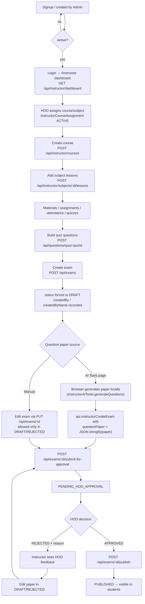

### Rules enforced for instructors (`InstructorAccessService` + `ExamApprovalService`)

- Instructors may **view** every course but may **manage** only a course/subject with an `ACTIVE` assignment row → otherwise HTTP 403.
- Instructors may only submit/publish/delete **exams they created** (`createdBy`), legacy null-`createdBy` rows fall back to the course-assignment check.
- An exam cannot be edited while `PENDING_HOD_APPROVAL`, `APPROVED`, `PUBLISHED` or `COMPLETED`.
- A plain `PUT /api/exams/:id` cannot smuggle a status change; publishing requires `POST /:id/publish`.
- Certificates: `POST /api/instructor/certificates/generate`, `PUT /:id/revoke`, `GET /verify/:certId`, `GET /stats`.

---

## 4. HOD workflow

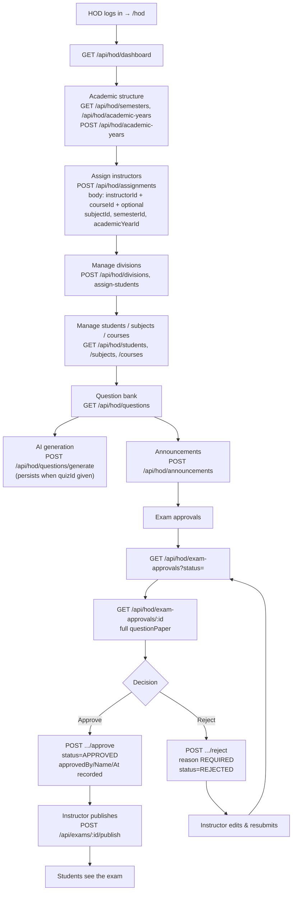

### The exact approval rules (`ExamApprovalService`, server-enforced)

| # | Rule | Implementation |
|---|---|---|
| 1 | Instructor must be assigned to the exam's course | `requireAssignedToExamCourse` → `InstructorAccessService.requireCourseManage` |
| 2 | Only the creator may submit/publish (staff bypass) | `requireOwnerOrStaff` |
| 3 | Publishing requires `APPROVED`, else **403** | `publish()` throws `AccessDeniedException(NOT_APPROVED_MESSAGE)` |
| 4 | Only HOD/ADMIN decide, only within their department | `requireApprover` + `requireDepartmentScope` (`departmentCourseId` = HOD's profile course) |
| 5 | Nobody approves their own exam | `requireNotSelfApproved` |
| 6 | Rejection reason is mandatory | `reject()` throws when blank |
| 7 | Admin may force any status | `overrideStatus()` (ADMIN only) — statuses DRAFT/PENDING_HOD_APPROVAL/REJECTED/APPROVED/PUBLISHED/COMPLETED |

`requireHOD()` guards most `/api/hod/**` routes; the division routes use `requireHODOrAdmin()`.
**Note:** `requireHOD()` accepts *only* `Role.HOD`, so an ADMIN cannot use the HOD dashboard endpoints (except divisions).

---

## 5. Exam lifecycle (every step verified in code)

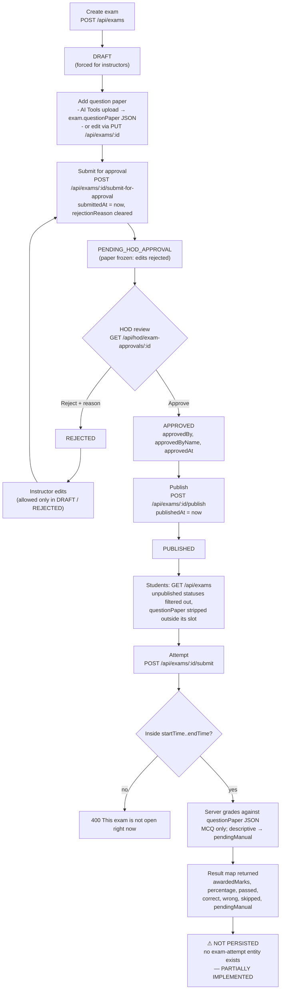

Status constants: `DRAFT`, `PENDING_HOD_APPROVAL`, `REJECTED`, `APPROVED`, `PUBLISHED`, `COMPLETED`
(legacy `SCHEDULED` / `LIVE` still exist on old rows and are treated as visible to students).

**Visibility rule** (`ExamController.visibleToStudent`): students never see `DRAFT`,
`PENDING_HOD_APPROVAL`, `REJECTED` or `APPROVED` exams, and the answer key (`questionPaper`) is
stripped from every response unless the exam is inside its scheduled slot.

---

## 6. Question bank workflow

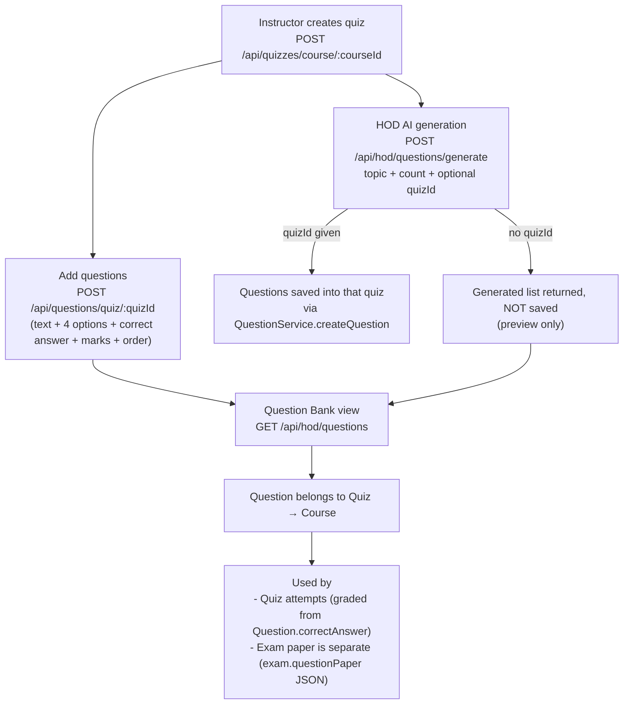

**What is real vs. placeholder in the HOD question bank list:**

| Field in `GET /api/hod/questions` | Source |
|---|---|
| `id`, `question`, `title`, `marks` | real `Question` columns |
| `quizId`, `courseId`, `courseName` | real joins through `Question.quiz` |
| `type: "MCQ"` | **hard-coded** — the entity has no type column |
| `difficulty: "Medium"` | **hard-coded** — no difficulty column |
| `status: "ACTIVE"` | **hard-coded** — no status column |

So: **question creation, marks, ownership through the quiz's course, and course-manage
authorisation are IMPLEMENTED; question type / difficulty / approval status are
NOT IMPLEMENTED (placeholder literals).** There is no separate "question paper approval" entity —
the question paper is part of the Exam and goes through the **exam approval workflow** above.

**Question model (actual):** `questionText`, `optionA..optionD`, `correctAnswer`, `marks`,
`questionOrder`, FK `quiz_id` (NOT NULL). Question types supported at persistence level = MCQ only;
descriptive/1-liner/2-marker/3-marker/5-marker questions exist **only inside the JSON question
paper**, where `ExamService` counts them as `pendingManual` (human grading required).

---

## 7. Enrolment → progress → certificate

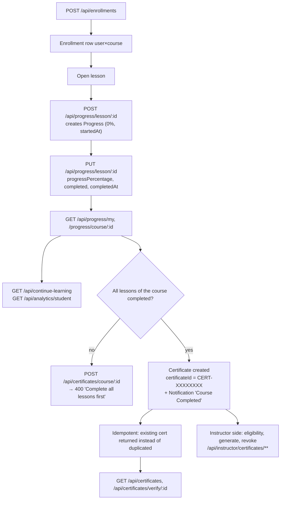

---

## 8. Notification workflow — **PARTIALLY IMPLEMENTED**

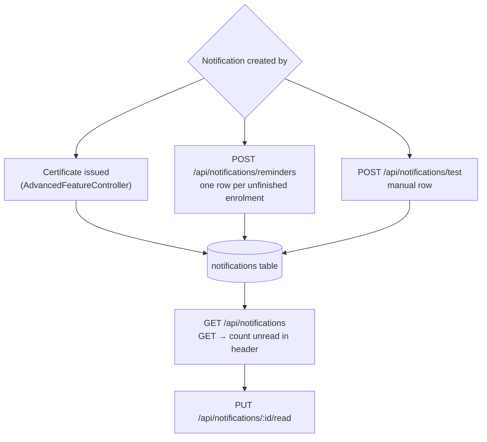

**Not present anywhere in the code:** email delivery, push/SSE/WebSocket, scheduled jobs,
notification creation on exam publication, on new assignment, on discussion reply, or on rejection.
Marked **PARTIALLY IMPLEMENTED** in FEATURE-MATRIX.md.

---

## 9. Admin workflow

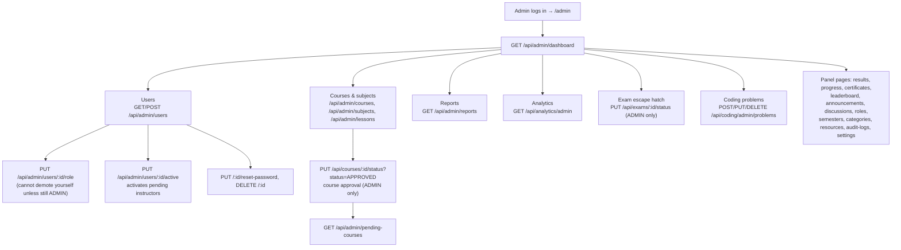

---

## 10. Frontend offline / error workflow (real code behaviour)

```mermaid
flowchart TD
    A[apiRequest] --> B{HTTP status}
    B -->|2xx| C[Return parsed JSON]
    B -->|401| D["Clear localStorage token+user<br/>redirect /login (except on auth pages)"]
    B -->|403| E[Throw server error message]
    B -->|other| F[Throw message / 'Request failed (status)']
    A --> G{fetch threw?}
    G -->|AbortError / TypeError| H["_backendDown = true<br/>(connectivity problem)"]
    H --> I["safeApiRequest → null<br/>page uses local/mock fallback"]
    H --> J["strictApiRequest → null only if already offline;<br/>real API errors still thrown"]
```

---

## 11. Workflows that are NOT implemented

| Workflow | Status | Evidence |
|---|---|---|
| Exam result history / student exam attempts table | **NOT IMPLEMENTED** | `ExamService.gradeSubmission` returns a `Map`, nothing is saved; no entity exists |
| Email delivery of password reset tokens | **NOT IMPLEMENTED** | `POST /api/auth/forgot-password` returns the token in the response body ("Demo mode") |
| Email / push notifications | **NOT IMPLEMENTED** | only `Notification` rows in MySQL |
| Question approval (separate from exam approval) | **NOT IMPLEMENTED** | questions have no status/approver fields |
| AI-generated feedback on submissions | **NOT IMPLEMENTED** | no such endpoint |
| Voice assistant / speech input | **NOT IMPLEMENTED** | no microphone or speech code anywhere |
| Python / FastAPI AI micro-service | **NOT IMPLEMENTED** | mentioned in a UI footer string only; no Python source in the repo |
