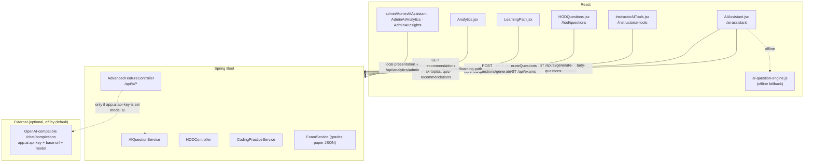
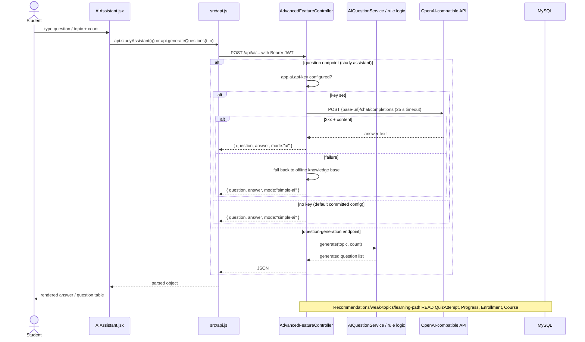
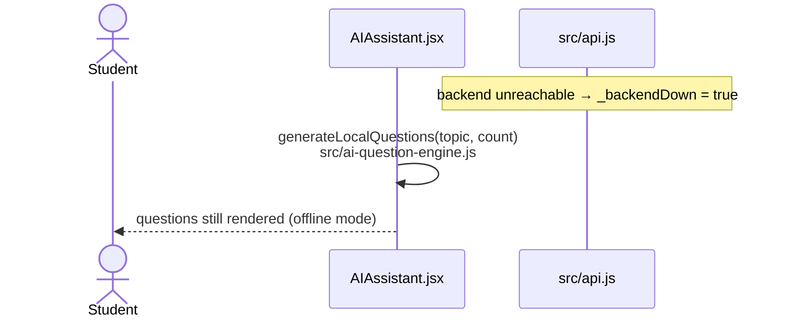

# AI-Smart-LMS — AI Architecture

> **What this document covers:** only AI features that exist in the source code today.
>
> **Verified findings:**
> - There is **no machine-learning model, no Python service and no TensorFlow runtime** anywhere
>   in the repository (no `ai-service/` folder, no Python file, no ML dependency in
>   `backend/pom.xml` or `package.json`).
> - There **is** an outbound HTTP call to an **OpenAI-compatible chat-completions API** in the
>   backend, used by the study assistant. It is **optional and disabled by default**: it only
>   runs when `app.ai.api-key` is set in `backend/src/main/resources/application.properties`
>   (all three `app.ai.*` lines are commented out in the committed file).
> - Everything else labelled "AI" is **rule-based Java/JavaScript logic** — keyword matching,
>   curated question banks, string templates and simple aggregates over the student's own data.

---

## 1. Inventory of AI features

| # | Feature | Status | Implementation type |
|---|---|---|---|
| 1 | AI Question Generator (server) | **IMPLEMENTED** | Curated banks + string templates (`AIQuestionService`) |
| 2 | AI Question Generator (HOD, persists into a quiz) | **IMPLEMENTED** | Same engine + `QuestionService` save |
| 3 | AI Question Generator (browser fallback) | **IMPLEMENTED** | `src/ai-question-engine.js` (local, offline) |
| 4 | Instructor AI Tools (question paper builder) | **IMPLEMENTED** | Fully local generator inside `InstructorAITools.jsx` |
| 5 | AI Study Assistant — offline knowledge base | **IMPLEMENTED** | Keyword router → canned answers (`"mode":"simple-ai"`) |
| 6 | AI Study Assistant — external LLM mode | **IMPLEMENTED but disabled by default** | `java.net.http.HttpClient` → OpenAI-compatible `/chat/completions` when `app.ai.api-key` is configured (`"mode":"ai"`) |
| 7 | AI Course Recommendations | **IMPLEMENTED** | Keyword overlap ranking over DB data |
| 8 | AI Weak Topic Detection | **IMPLEMENTED** | `percentage < 60` filter over `QuizAttempt` |
| 9 | AI Learning Path | **IMPLEMENTED** | Completion check over `Progress` |
| 10 | AI Quiz Recommendations | **IMPLEMENTED** | Derived from #8 |
| 11 | Coding AI Assist (hint / explain / complexity / debug) | **IMPLEMENTED** | Templates + stored `hintsJson` |
| 12 | Admin AI Assistant / AI Analytics / AI Insights pages | **IMPLEMENTED (UI)** | Presentation logic over the same server endpoints and local data |
| 13 | Python (FastAPI) AI micro-service | **NOT IMPLEMENTED** | Claimed in a UI footer string only; no Python source in the repo |
| 14 | TensorFlow / trained ML model | **NOT IMPLEMENTED** | Words inside answer text only; no dependency, no model file |
| 15 | Voice assistant / speech recognition | **NOT IMPLEMENTED** | No `getUserMedia`, no speech API, no streaming audio in the source |

---

## 2. Feature-by-feature breakdown

### 2.1 AI Question Generator — `AIQuestionService`

| Aspect | Detail |
|---|---|
| **Input** | `{ topic: string, count?: number (alias `limit`) }` |
| **Processing** | 1) normalize topic; 2) `getCuratedBankForTopic()` matches keywords (`oop/object/class/inherit/polymorph/encapsul`, `java` *(not javascript)*, `python`, `dbms/sql/database`, `data struct/dsa/algorithm/tree/graph`, `network/osi/tcp/ip`, `operating system/os/process/thread`, `web/html/css/react/javascript`) and pulls **hard-coded `QuestionItem` lists**; 3) de-duplicates by question text; 4) `generateAlgorithmicQuestions()` fills the remainder from **~10 sub-dimensions × string templates** with the topic substituted via `%s` |
| **Output** | `List<Map>`: `id, question, optionA..D, correctAnswer, explanation, difficulty, topic, marks, generatedBy:"AI-Smart-LMS-Engine"` |
| **Limits** | default count **100**, hard ceiling **200** |
| **Endpoint** | `POST /api/ai/generate-questions` (any authenticated user) · `POST /api/hod/questions/generate` (HOD, persists into a quiz when `quizId` supplied) |
| **Backend service** | `service/AIQuestionService.java` (683 lines) |
| **Frontend** | `src/pages/AIAssistant.jsx` (with `generateLocalQuestions` fallback), `src/pages/hod/HODQuestions.jsx` |
| **Type** | **rule-based template engine — not an ML model, not an LLM** |

> The HOD endpoint's `quizId` behaviour exists because "the Question Bank table actually showed
> nothing" when the list was returned unsaved — see the Javadoc on `HODController.generateQuestions`.

### 2.2 AI Study Assistant — `POST /api/ai/study-assistant`

Two modes, decided at request time by `AdvancedFeatureController`:

```
request { question }
   │
   ├─ 1. askFullAI(question)          ← runs ONLY when app.ai.api-key is non-blank
   │      POST {app.ai.base-url}/chat/completions
   │      headers: Authorization: Bearer <app.ai.api-key>
   │      body: { model: app.ai.model, messages:[system,user], max_tokens:600, temperature:0.4 }
   │      timeout: 25 s
   │      ├─ HTTP 2xx + non-empty content → return { question, answer, mode: "ai" }
   │      └─ any failure (no key, timeout, bad key, non-2xx) → fall through
   │
   └─ 2. offline knowledge base       ← default behaviour with the committed config
          lowerQuestion.contains(...) chain over 16 keyword groups
          → { question, answer, mode: "simple-ai" }
```

| Aspect | Detail |
|---|---|
| **Input** | `{ question: string }` — blank/missing question returns a canned prompt answer with `mode:"simple-ai"` |
| **LLM config (all commented out by default)** | `app.ai.api-key`, `app.ai.base-url` (default `https://api.openai.com/v1`), `app.ai.model` (default `gpt-4o-mini`) — `application.properties`; documented in-file as working with "OpenAI, Groq, OpenRouter, DeepSeek" |
| **Offline keyword branches (19, in order)** | `dependency injection` · `jwt`/`json web token` · `jpa`/`hibernate` · `oop`/`object oriented` · `sql`/`database`/`dbms` · `spring`/`spring boot` · `java` (excluding `javascript`) · `programming in c` · `react`/`javascript`/`frontend`/`web` · `algorithm`/`data structure`/`dsa` · `api`/`rest`/`endpoint` · `python` · `network`/`tcp`/`http`/`osi` · `operating system`/` os `/`thread`/`process` · `machine learning`/`ai `/`artificial intelligence`/`neural network`/`deep learning` · `git`/`version control` · `html`/`css` · `software engineering` · `design pattern` → else a generic fallback |
| **Output** | `{ question, answer, mode: "ai" \| "simple-ai" }` |
| **HTTP client** | JDK `java.net.http.HttpClient` (no extra dependency added to `pom.xml`) |
| **Backend** | `AdvancedFeatureController.studyAssistant()` + private `askFullAI()` (lines ~2030–2440) |
| **Frontend** | `src/pages/AIAssistant.jsx` → `api.studyAssistant(question)` |
| **Key/server side** | The key, if any, stays on the Spring Boot side; the browser never receives it |

### 2.3 AI Course Recommendations — `GET /api/ai/recommendations`

| Aspect | Detail |
|---|---|
| **Input** | current user (JWT) |
| **Processing** | builds a "signal" = the **title of the lowest-scoring quiz attempt**; takes all `APPROVED` courses **not** already enrolled; sorts by whether any word (length > 2) of that signal appears in `title + description + category`; returns top **5** |
| **Output** | `List<Course>` |
| **Type** | **rule-based keyword matching** |

### 2.4 AI Weak Topics — `GET /api/ai/weak-topics`

| Aspect | Detail |
|---|---|
| **Processing** | all of the user's `QuizAttempt` rows where `percentage < 60`; emits `{ topic: quizTitle, score, recommendation: "Review this topic and retry the quiz." }` |
| **Type** | **threshold rule over real data** |

### 2.5 AI Learning Path — `GET /api/ai/learning-path`

| Aspect | Detail |
|---|---|
| **Processing** | computes the set of enrolments where **every** lesson has a `Progress` row with `completed = true`; returns the first **8** `APPROVED` courses as `{courseId, title, status: COMPLETED \| RECOMMENDED}` |
| **Type** | **completion-status rule** |

### 2.6 AI Quiz Recommendations — `GET /api/ai/quiz-recommendations`

Re-shapes weak topics into `{ topic, reason: "Low quiz score", action: "Practice this quiz again" }`.

### 2.7 Coding AI Assist — `POST /api/coding/ai-assist`

| Aspect | Detail |
|---|---|
| **Input** | `{ problemId, language, code, action, userPrompt }` |
| **Processing** | `switch (action)` → `explain` (builds markdown from the problem's own fields), `hint` (random entry from the stored `hintsJson`, else a generic hint), `complexity` (fixed complexity text), `debug` (fixed diagnostic template), plus more |
| **Backend** | `CodingPracticeService.getAiAssist(...)` |
| **Frontend** | `src/pages/CodingPlayground.jsx` |
| **Type** | **templates over stored problem metadata — the code is never analysed by a model** |

### 2.8 Instructor AI Tools — `src/pages/instructor/InstructorAITools.jsx`

A browser-side question **paper** builder: it has its own `generateQuestions(topic, type, count)`
over local pools (1-liner / 2-marker / 3-marker / 5-marker / MCQ), parses the generated lines,
assembles `{ title, subject, sections, totalQuestions, totalMarks, duration, difficulty }`, and then
**uploads it as an exam**:

```js
await api.instructorCreateExam({ ..., questionPaper: JSON.stringify(paperData), course: { id } })
```

That JSON is what `ExamService.gradeSubmission()` later grades against.
**100 % client-side generation.** This path never calls the external LLM mode — only
`/api/ai/study-assistant` does.

### 2.9 Analytics (presented in AI analytics pages)

`GET /api/analytics/student`, `/api/analytics/course/{id}`, `/api/analytics/admin` — plain
aggregations over `QuizAttempt`, `Progress`, `Enrollment`, `Course`, `User`. No model.

---

## 3. Where each AI feature lives



---

## 4. AI request flow (as actually implemented)





**Voice flow:** there is **no microphone capture, no speech recognition and no streaming audio
anywhere in the source** → NOT IMPLEMENTED.

---

## 5. Summary of the AI layer as it is today

- **Two AI entry mechanisms exist:** (a) in-process rule/template engines used by question
  generation, recommendations, weak topics, learning path and coding assist; (b) one optional
  outbound HTTPS call to an OpenAI-compatible chat-completions API used exclusively by
  `POST /api/ai/study-assistant`.
- **Configuration lives in `backend/src/main/resources/application.properties`:**

  ```properties
  # Optional: real AI answers for /api/ai/study-assistant (any OpenAI-compatible API
  # such as OpenAI, Groq, OpenRouter or DeepSeek). Leave unset to use the built-in
  # offline knowledge base.
  # app.ai.api-key=sk-...
  # app.ai.base-url=https://api.openai.com/v1
  # app.ai.model=gpt-4o-mini
  ```

  With the file as committed (all three commented out), `askFullAI()` returns `null`
  immediately and every study-assistant answer comes from the offline knowledge base.
- **The response contract is stable either way:** `{ question, answer, mode }`, where `mode` is
  `"ai"` (external model) or `"simple-ai"` (offline knowledge base).
- **No AI feature touches the database schema** — generated questions are returned as JSON or
  saved through the existing `QuestionService` path; recommendations/analytics only read
  existing tables.
- **Not present:** ML training/inference, embeddings, vector search, prompt caching, streaming
  responses, tool calling, and any AI call other than the one described above.
